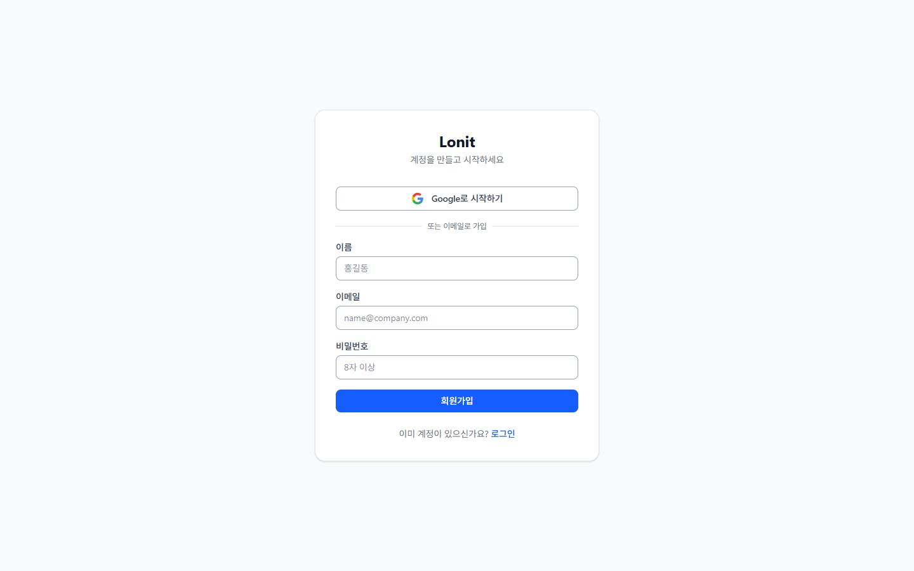
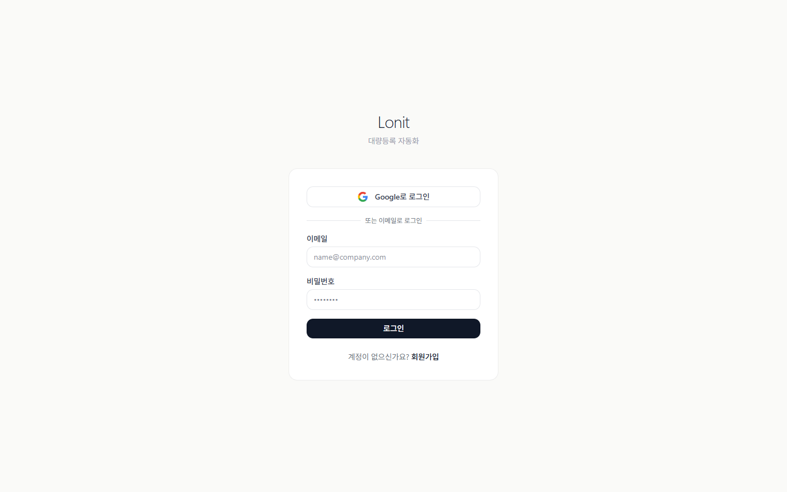
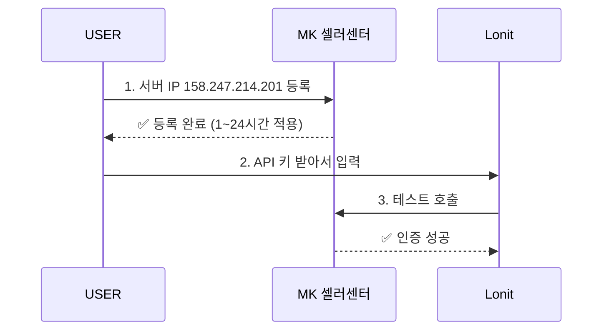
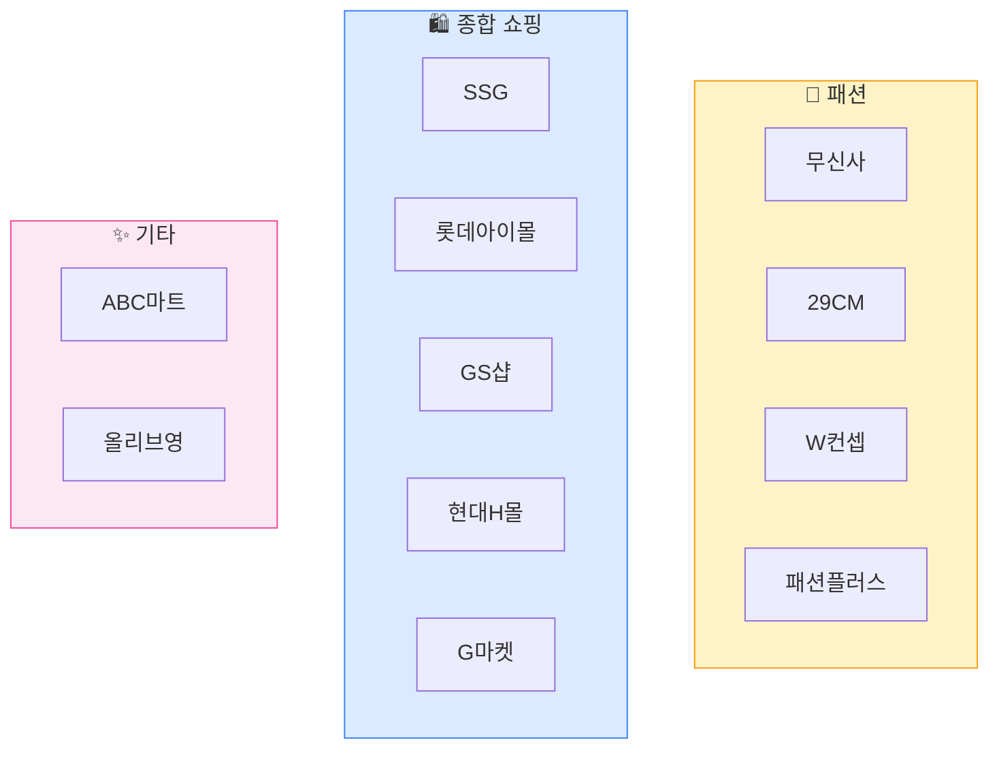
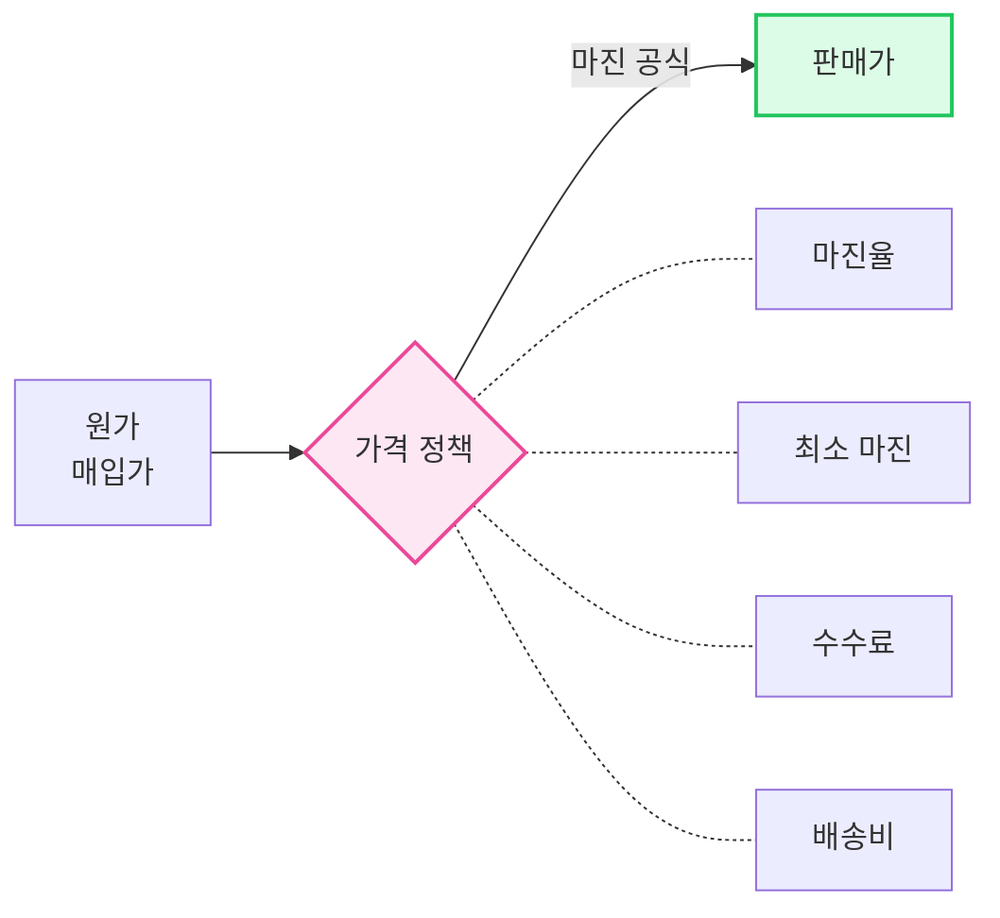
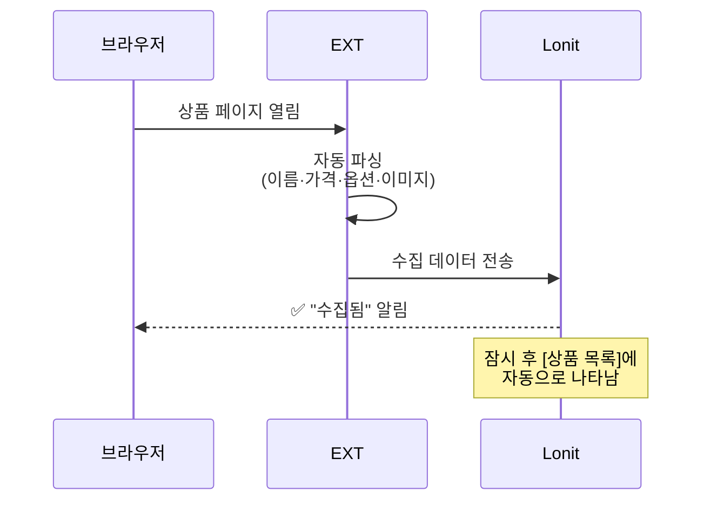
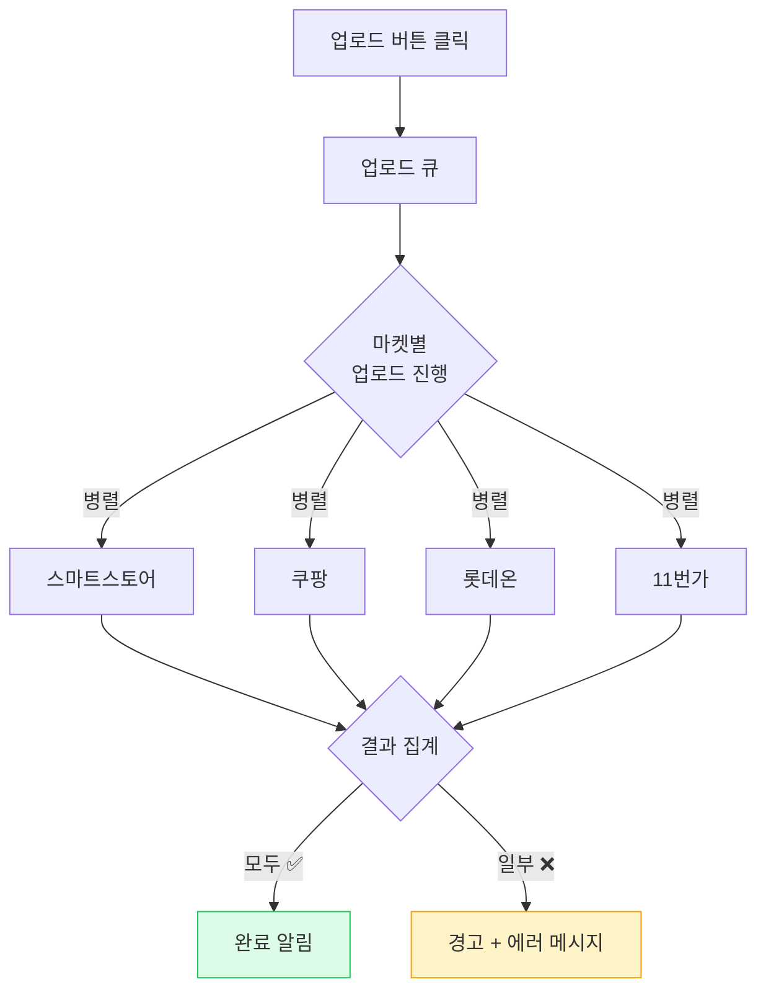
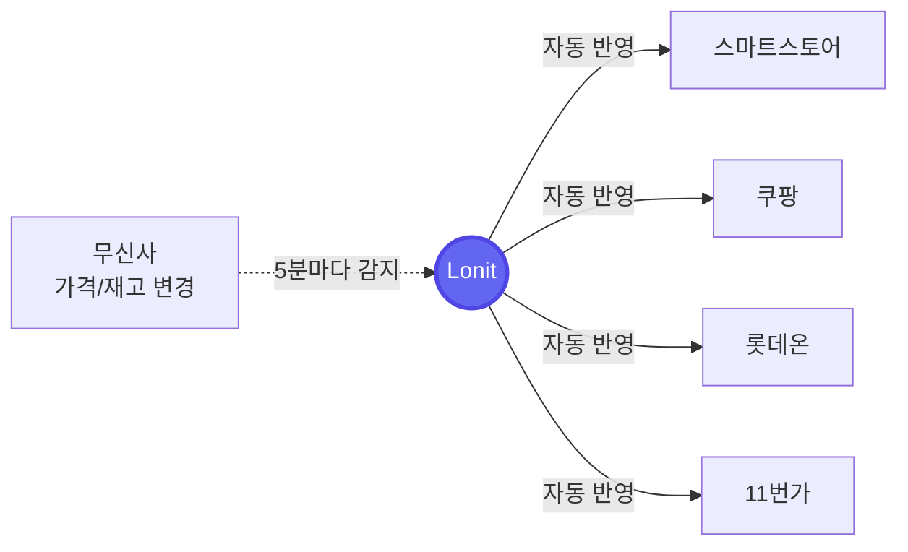

# 5분 빠른 시작

> **목표**: 가입 → 마켓 계정 등록 → 첫 상품 4마켓 업로드까지 한 번에.

!!! tip "🎯 이 챕터에서 배우는 것"
    - Lonit 가입 + 작업 공간 자동 생성 확인
    - 4마켓 API 키 발급 + IP 등록 (가장 막히는 부분)
    - 크롬 익스텐션 설치 + 12개 사이트 활용
    - 가격 정책 1개 만들고 첫 상품 4마켓 동시 업로드

이 챕터를 다 따라하면, 무신사에서 본 옷 한 벌이 스마트스토어·쿠팡·롯데온·11번가에 동시에 올라가 있습니다. 마켓 검수 정책에 따라 즉시 노출되는 마켓도 있고, 임시저장 → 승인요청 단계가 필요한 마켓도 있어요.

<div class="lonit-flow primary" markdown>
<div class="flow-stage primary" markdown>
<div class="flow-stage-title">🚀 5분 안에 끝내는 6단계</div>
<ol class="flow-stage-steps">
<li>👤 회원가입 + 작업 공간 확인</li>
<li>🔑 4마켓 API 키 + 서버 IP 등록</li>
<li>🌐 크롬 익스텐션 설치</li>
<li>💰 가격 정책 1개 만들기 (마진/최소마진/단위)</li>
<li>📦 첫 상품 수집 (무신사에서 익스텐션 클릭)</li>
<li>🚀 4마켓 동시 업로드</li>
</ol>
</div>
</div>

---

## 1. 회원가입

[lonit.kr](https://lonit.kr) 에서 이메일과 비밀번호로 가입합니다.

<figure markdown>
  { width="65%" }
  <figcaption>회원가입 화면 — 이름·이메일·비밀번호 + Google 계정 연동</figcaption>
</figure>

이미 계정이 있다면 로그인:

<figure markdown>
  { width="65%" }
  <figcaption>로그인 화면 — Google 또는 이메일</figcaption>
</figure>

!!! tip "💡 가입 직후 자동으로 생기는 것"
    가입하면 Lonit이 자동으로 **나만의 작업 공간**을 만들어 줍니다. 이 공간 안에서 등록한 상품·계정·주문은 다른 셀러에게 절대 보이지 않습니다.

가입 후 처음 보이는 화면은 **대시보드**입니다. 여기서 모든 작업이 시작됩니다.

---

## 2. 마켓 계정 등록 (가장 중요)

대시보드 왼쪽 메뉴에서 **설정 → 마켓 계정** 으로 이동합니다.

### 2-1. 등록할 마켓 4가지

| 마켓 | 필요한 것 | 어디서 받나? |
|------|----------|------------|
| **스마트스토어** | API 키 + 시크릿 | 네이버 커머스 솔루션 → API 관리 |
| **쿠팡** | Access Key + Secret Key | 쿠팡 Wing → 개발자 센터 → Open API |
| **롯데온** | API Key + 매장 ID | 롯데온 셀러센터 → API 인증 |
| **11번가** | API Key | 11번가 셀러오피스 → 시스템 → 인증키 |

### 2-2. ⚠️ 서버 IP 등록 (필수)

Lonit이 마켓 API를 호출할 때, 마켓 쪽에서 "허용된 IP만" 받아주는 곳이 있습니다. 다음 IP를 마켓 셀러센터에 미리 등록해 두세요.

```
158.247.214.201
```

!!! warning "IP 등록 안 하면?"
    마켓 API 호출이 모두 실패합니다. 등록 후 마켓에 따라 1~24시간 적용 시간이 필요합니다. **마켓 계정을 등록하기 전 IP부터 마켓 셀러센터에 추가**하는 것을 권장합니다.

서버 IP는 **설정 → 마켓 계정** 페이지 상단 배너에서도 확인 가능합니다.



### 2-3. 등록 방법

각 마켓별로 **+ 계정 추가** 버튼 → 받은 키를 입력 → **연결 테스트** 클릭.
초록불(✅)이 뜨면 성공. 빨간불(❌)이면 키 또는 IP를 확인합니다.


!!! tip "📌 한 마켓에 여러 계정"
    한 마켓에 여러 셀러 계정이 있어도 됩니다. 등록 시 **계정 별명**(예: "메인 스토어", "보조 스토어")만 다르게 주면 됩니다.

---

## 3. 크롬 익스텐션 설치

Lonit의 익스텐션은 **상품을 수집하는 도구**입니다. 무신사 같은 사이트의 상품 페이지를 열어 두고 익스텐션 버튼을 누르면 자동으로 정보를 가져옵니다.

### 3-1. 설치

1. Lonit 대시보드 → **익스텐션 다운로드** 클릭
2. ZIP 파일 압축 해제
3. Chrome → `chrome://extensions/` 접속
4. 우측 상단 **개발자 모드** 켜기
5. **압축해제된 확장 프로그램을 로드합니다** → 압축 푼 폴더 선택
6. 끝. 브라우저 우측 상단에 Lonit 아이콘이 보이면 성공.

### 3-2. 지원 사이트 12곳



각 사이트의 상품 페이지에서 익스텐션을 누르면 **상품명·가격·옵션·이미지·상세설명**이 한 번에 Lonit으로 들어옵니다.

---

## 4. 가격 정책 1개 만들기

상품 등록 전에 "**얼마에 팔지**" 규칙을 한 번 정해두면, 모든 상품에 자동 적용됩니다.

### 4-1. 정책이 하는 일



### 4-2. 첫 정책 만들기

대시보드 → **정책 → + 새 정책** 으로 이동.

| 항목 | 추천 첫 값 | 의미 |
|------|----------|------|
| 정책 이름 | `기본 정책` | 식별용 |
| 마진율 | `30%` | 원가의 30% 추가 |
| 최소 마진 금액 | `5,000원` | 마진율 적용해도 최소 5천원은 남겨야 |
| 수수료 | `12%` | 마켓 평균 수수료 |
| 가격 단위 | `100원` | 마지막 자리 100원 단위 정렬 (1234 → 1300) |

저장하면 됩니다. 자세한 규칙은 [7. 가격 정책](07-pricing.md) 참고.

!!! note "📌 정책은 여러 개 가능"
    카테고리별·마켓별로 다른 정책을 적용할 수도 있습니다. 일단은 **기본 정책 1개** 로 시작하세요.

---

## 5. 첫 상품 수집

[무신사](https://www.musinsa.com) 에서 마음에 드는 상품 페이지를 엽니다.

### 5-1. 익스텐션 누르기

상품 페이지에서 브라우저 우측 상단 **Lonit 아이콘** 클릭 → "이 상품 수집" 버튼.



### 5-2. 카테고리 자동 매핑

수집된 상품은 자동으로 **4마켓의 카테고리에 매핑**됩니다.

- 무신사 카테고리(예: "스니커즈") → 스마트스토어 카테고리(예: "패션잡화 → 신발 → 운동화/스니커즈")
- 쿠팡·롯데온·11번가도 동일

매핑이 잘못된 경우 [상품 상세] 화면에서 수동으로 바꿀 수 있습니다.

---

## 6. 4마켓 업로드

대시보드 → **상품 목록** → 방금 수집한 상품 → **업로드** 버튼.

### 6-1. 업로드 옵션

| 옵션 | 의미 |
|------|------|
| 전체 마켓 | 4개 마켓 동시 업로드 |
| 선택한 마켓 | 체크한 마켓만 |
| 시뮬레이션 | 실제 업로드 안 하고 검증만 |

처음에는 **시뮬레이션**으로 한 번 돌려서 에러가 없는지 확인 → 그 다음 실제 업로드.

### 6-2. 업로드 결과 확인



각 마켓 업로드는 **병렬로 동시에 진행**됩니다. 마켓 API 응답·검수 정책에 따라 수십 초에서 수 분까지 걸릴 수 있어요. 한 마켓이 느려도 다른 마켓은 영향받지 않습니다.

업로드 후 [활동 센터] 화면에서 결과를 확인할 수 있습니다.

| 상태 | 의미 |
|------|------|
| ✅ 완료 | 마켓에 등록 성공 |
| ⏳ 진행 중 | 마켓 응답 대기 |
| ⚠️ 스킵 | 카테고리 미매핑 등으로 건너뜀 |
| ❌ 실패 | 에러 발생, 메시지 확인 |

---

## 7. 동기화 자동 실행

상품 등록 후엔 **아무것도 안 해도 됩니다**. Lonit이 알아서:

- 무신사 가격이 바뀌면 → 4마켓 가격 자동 변경
- 무신사 재고가 0이 되면 → 4마켓 품절 처리
- 무신사 옵션이 추가되면 → 4마켓 옵션 추가



자세한 동기화 규칙은 [5. 일상 워크플로우](05-workflow.md) 참고.

---

!!! success "📌 한 줄 요약"
    가입 → IP 등록 → 4마켓 API 키 → 익스텐션 설치 → 정책 1개 → 첫 상품 수집 → 4마켓 업로드. **막히면 IP 등록 또는 API 키를 가장 먼저 의심**하세요.

---

## 다음 단계

이제 첫 상품을 4마켓에 올렸습니다. 다음으로 읽으면 좋은 챕터:

<div class="lonit-cards">

<a class="lonit-card" href="../04-market-strategy/">
<span class="lonit-card-icon">🎯</span>
<h3>4마켓 노출 전략</h3>
<p>마켓별로 잘 노출되는 법. 가장 중요한 챕터.</p>
</a>

<a class="lonit-card" href="../05-workflow/">
<span class="lonit-card-icon">🔄</span>
<h3>일상 워크플로우</h3>
<p>매일 어떻게 운영하는지 — 수집·등록·동기화의 흐름.</p>
</a>

<a class="lonit-card" href="../07-pricing/">
<span class="lonit-card-icon">💰</span>
<h3>가격 정책 깊이 알기</h3>
<p>마진 공식·정책 우선순위·카테고리별 다른 정책.</p>
</a>

</div>

!!! question "막혔어요"
    [트러블슈팅](08-troubleshooting.md)에서 자주 발생하는 에러를 확인하거나, `support@lonit.kr` 로 문의 주세요.
