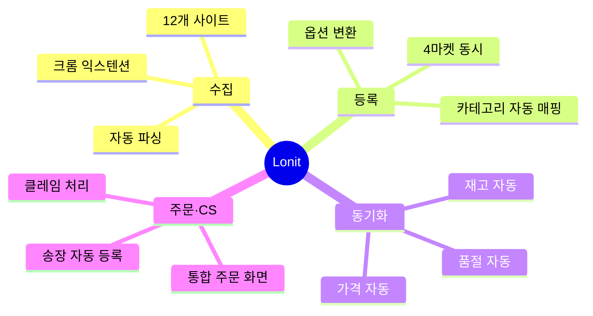
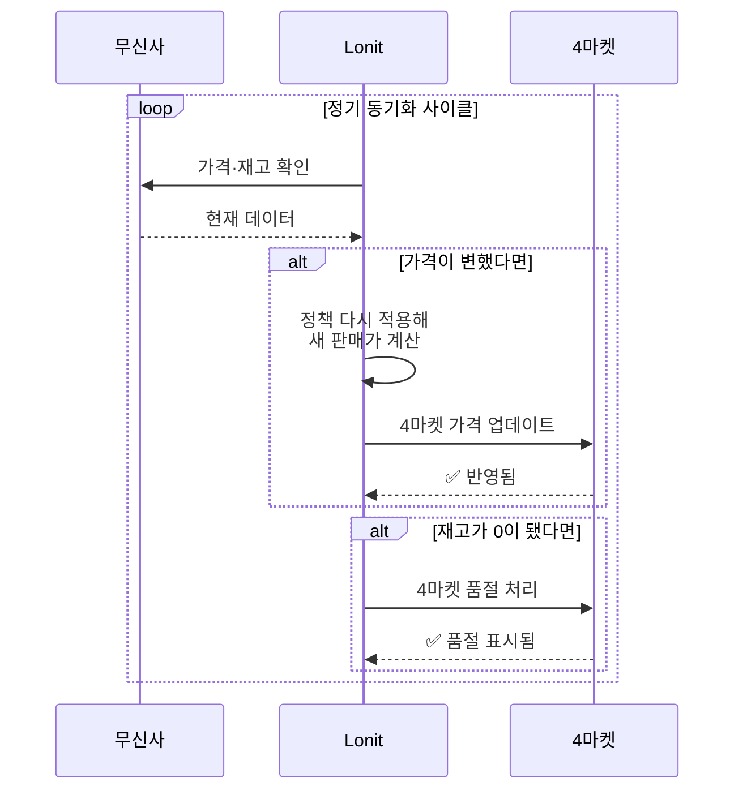
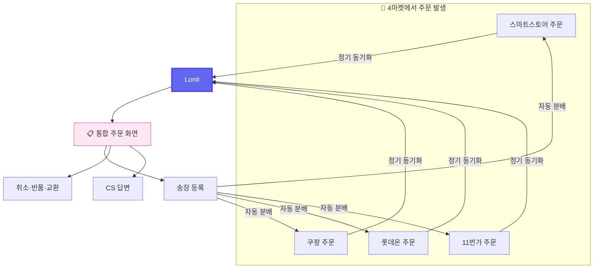
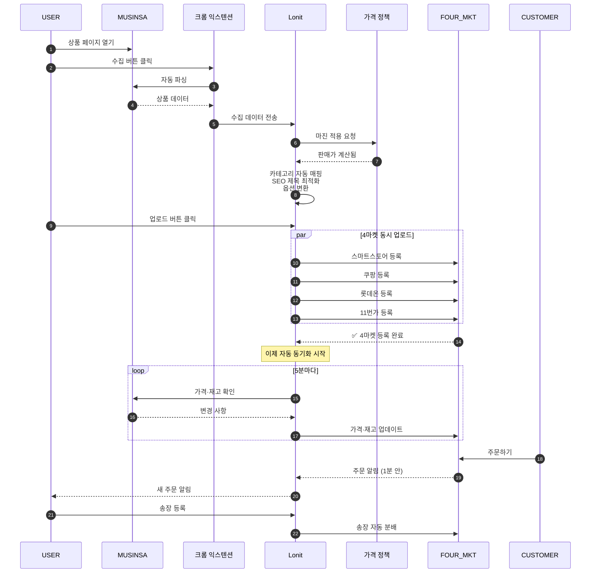
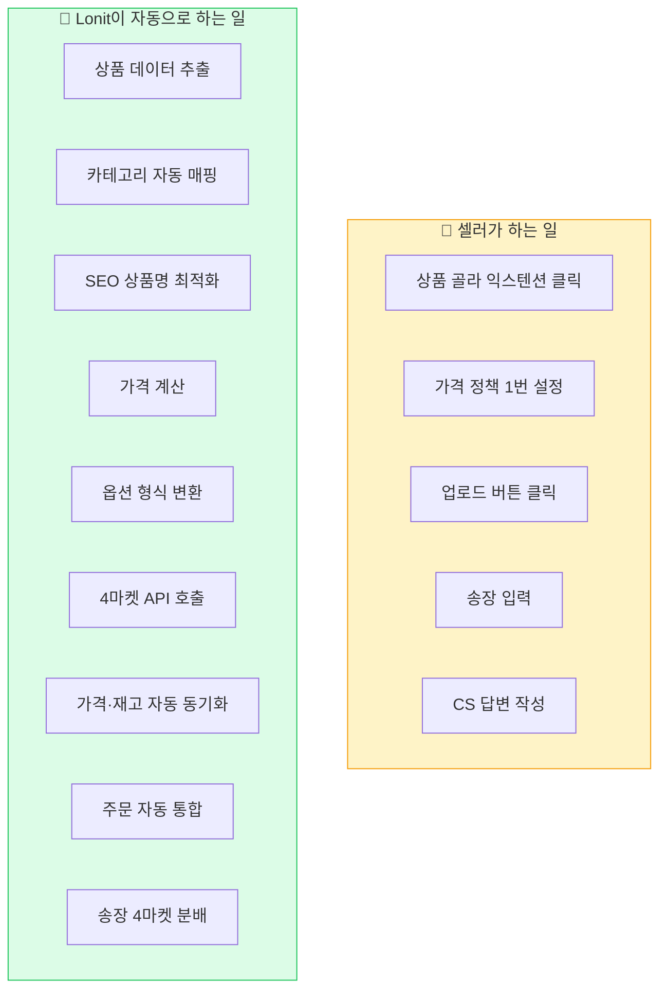
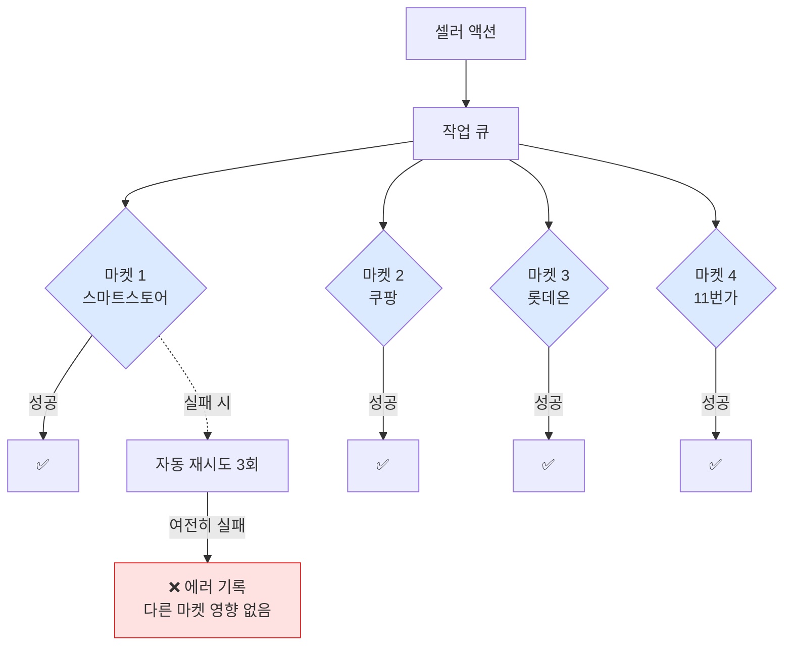

# 시스템 구조 한눈에 보기

> Lonit이 **어떻게** 동작하는지 그림으로 이해하기.

!!! tip "🎯 이 챕터에서 배우는 것"
    - Lonit의 4가지 핵심 기능 (수집·등록·동기화·주문)
    - 상품 1개가 무신사에서 마켓에 올라가기까지의 전체 흐름
    - "왜 4마켓 동시 등록이 가능한가" — 마켓별 변환 원리
    - 셀러가 직접 하는 일 vs Lonit이 자동으로 하는 일

이 챕터는 코드나 어려운 용어 없이, **그림 위주로** Lonit의 동작을 설명합니다. 처음 가입한 분이라면 [1. 시작하기](01-getting-started.md)부터 보시고, 강의 수강생은 이 챕터부터 시작하세요.

---

## 1. 한 장으로 보는 Lonit

📥 어디에서 상품을 가져오나요?

👗 무신사
🛍️ SSG
🏬 롯데아이몰
➕ 9개 사이트 더

↓
크롬 익스텐션으로 한 번에 모음

⚙️ Lonit이 자동으로 하는 6가지 일

<ol class="flow-stage-steps">
<li>소싱처에서 상품 정보 모으기 (수집)</li>
<li>내가 정한 가격 규칙 자동 적용</li>
<li>4개 마켓에 맞게 형식 변환</li>
<li>4개 마켓에 동시 업로드</li>
<li>가격·재고가 바뀌면 4마켓 자동 갱신</li>
<li>주문·CS 한 화면에서 처리</li>
</ol>

↓
4마켓 API에 자동 전송

📤 어디에 올라가나요?

🛒 스마트스토어
📦 쿠팡
🏪 롯데온
🎁 11번가

**셀러가 하는 일은 "익스텐션 클릭" + "정책 한 번 설정"** 정도. 나머지는 위 6단계가 자동으로 돌아갑니다.

---

## 2. 핵심 4기능

각 기능을 하나씩 봅시다.

### 2-1. 수집 (Collect)

1단계 — 셀러가 할 일

👤 무신사 같은 사이트에서
📄 상품 페이지를 열고
🖱️ 익스텐션 클릭

↓
익스텐션이 페이지를 자동으로 읽어옴

2단계 — 자동으로 가져오는 정보

🏷️상품명

💰가격

📏옵션·사이즈

🖼️이미지 여러 장

📝상세 설명

🏷️브랜드

↓
Lonit 작업 공간에 저장

3단계 — Lonit에 저장 완료

💾 상품 목록에 자동 등록
🔍 검색·편집 가능

!!! note "수집은 곧 '복제'가 아닙니다"
    Lonit은 소싱처의 **상품 정보**를 가져옵니다. 가격·이미지·설명을 그대로 마켓에 올리는 게 아니라, [가격 정책](07-pricing.md)을 적용해 새로운 판매가를 계산하고, [SEO 최적화](04-market-strategy/smartstore.md)로 상품명을 다듬어 올립니다.

### 2-2. 등록 (Upload)

📦 출발 — 상품 1개

제목·가격·옵션·이미지·설명을 가진
Lonit 작업 공간의 상품 1건

↓
4마켓 각각의 형식에 맞게 자동 변환

⚡ 4마켓 동시 업로드 (병렬)

🟢 스마트스토어 — 네이버 SEO 형식
🔴 쿠팡 — 옵션 30자 / 카테고리 5단계
🔴 롯데온 — 매장 ID + 발주 정책 결합
🟠 11번가 — KC 자동 + 브랜드 병기

↓
결과 모음

📊 활동 센터에서 결과 확인

✅ 성공 — 마켓에 등록 완료
⚠️ 스킵 — 카테고리 미매핑 등
❌ 실패 — 에러 메시지 표시

!!! tip "🎯 핵심 — 한 마켓 느려도 다른 3개는 영향 없음"
    4마켓은 **각자 독립된 큐로 동시에** 업로드됩니다. 쿠팡 검수가 오래 걸려도 스마트스토어는 즉시 등록 완료. 한 마켓 실패가 전체를 막지 않습니다.

### 2-3. 동기화 (Sync)

이건 Lonit의 **가장 큰 가치**입니다. 등록 후엔 아무것도 안 해도 자동.

!!! info "동기화 주기에 대한 사실"
    Lonit은 정기 스케줄러(약 30분 주기)로 변경 사항을 점검하며, 즉시 push가 필요한 변경(정책 수정 등)은 별도 경로로 처리합니다. 마켓 API 응답 속도와 큐 상태에 따라 실제 반영 시간은 달라집니다.

### 2-4. 주문·CS

**4개 마켓 따로 주문 받아 처리**할 필요가 없습니다. 한 화면에서 다 보고, 송장도 한 번 등록하면 4마켓에 자동 분배.

자세한 흐름은 [6. 주문 + CS](06-orders-cs.md) 참고.

---

## 3. 데이터의 일생 — 한 상품이 거치는 길

상품 1개가 무신사에서 시작해 마켓에 올라가고 주문 받기까지의 전체 흐름:

---

## 4. "왜 4마켓 동시"가 가능한가?

질문: 마켓마다 API 형식·정책·카테고리·옵션 규칙이 다 다른데, 어떻게 한 상품을 동시에 올릴 수 있을까?

**답: Lonit이 마켓별 변환을 자동으로 합니다.**

각 마켓의 **고유한 규칙은 [4. 4마켓 노출 전략](04-market-strategy/index.md)**에서 자세히 설명합니다.

---

## 5. 자동 vs 수동 — 무엇을 셀러가 하고 무엇을 Lonit이 할까

!!! tip "💡 셀러는 '결정'만 합니다"
    "어떤 상품을 올릴지", "얼마에 팔지" 같은 **결정**은 사람이. 그 외 반복 작업(매핑·변환·동기화·분배)은 모두 Lonit이.

---

## 6. 멀티마켓 동시 운영의 안전장치

4마켓을 동시에 운영하면 한 마켓이 느리거나 에러가 나도 다른 마켓에 영향 없어야 합니다. Lonit의 안전장치:

**핵심 안전장치**:

- **마켓별 독립 실행**: 한 마켓 실패가 다른 마켓 막지 않음
- **자동 재시도**: 일시적 에러(네트워크 타임아웃 등)는 3회 자동 재시도
- **속도 제한**: 마켓 API의 호출 한도(분당 N회)를 자동으로 지킴
- **계정별 격리**: 한 셀러의 작업이 다른 셀러에 영향 없음

자세한 트러블슈팅은 [8. 트러블슈팅](08-troubleshooting.md) 참고.

---

!!! success "📌 한 줄 요약"
    **Lonit = 12개 사이트 → 4마켓 → 자동 동기화** 를 한 화면에서 관리하는 컨트롤타워. 셀러는 결정만, 반복 작업은 자동.

## 7. 한 줄 요약

> **Lonit = 12개 사이트 → 4마켓 → 자동 동기화** 를 한 화면에서 관리하는 컨트롤타워.

다음 챕터에서는 같은 일을 하는 **T사**와 무엇이 어떻게 다른지 봅니다.

<a class="lonit-card" href="../03-vs-others/">
🆚
<h3>3. T사와 비교</h3>

차이점·장단점·갈아타기 가이드

</a>

<a class="lonit-card" href="../04-market-strategy/">
🎯
<h3>4. 마켓별 노출 전략</h3>

알고리즘 차이 + 잘 노출되는 법

</a>

