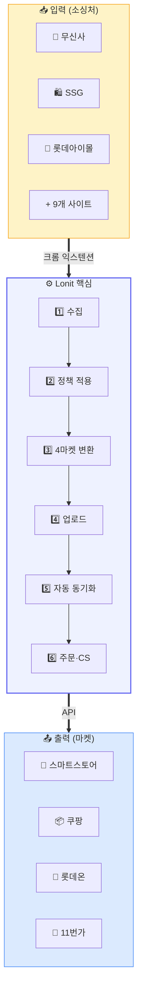
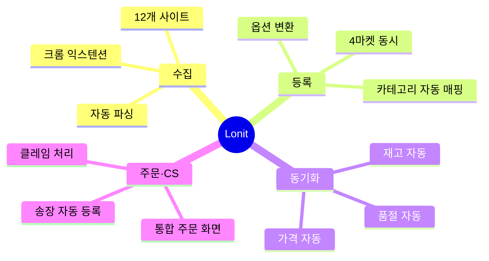
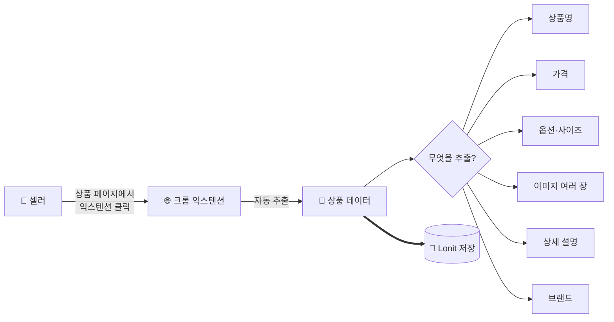
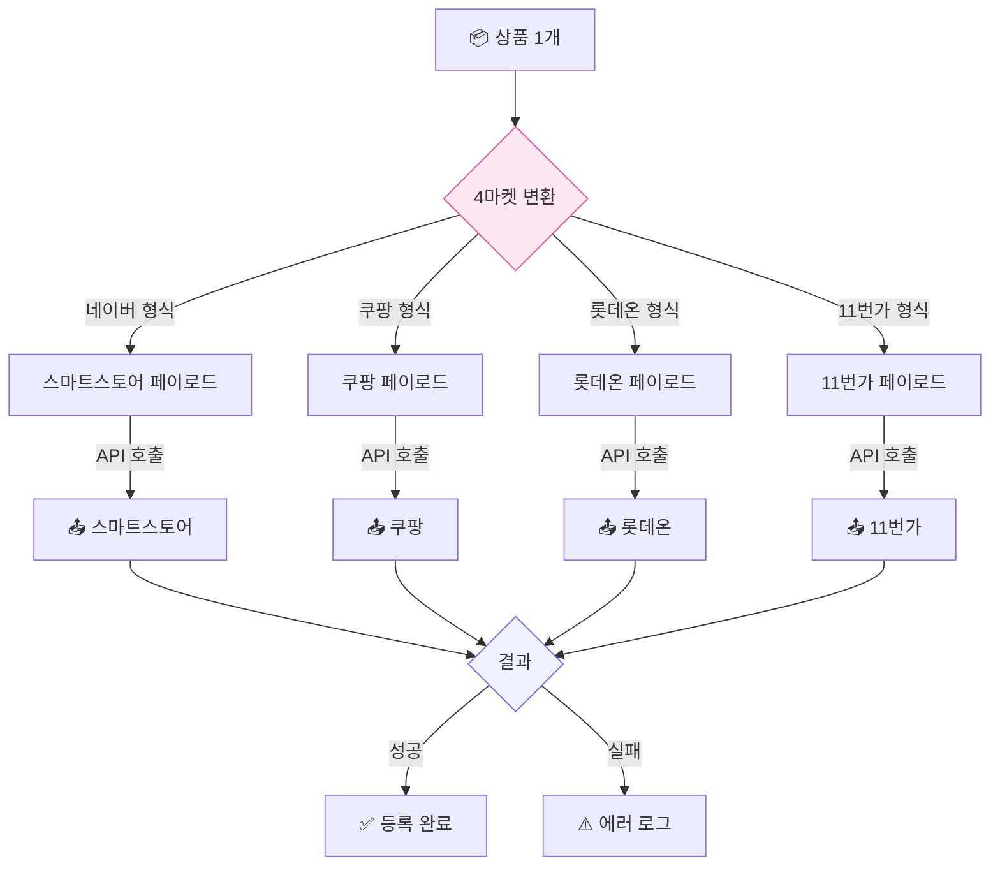
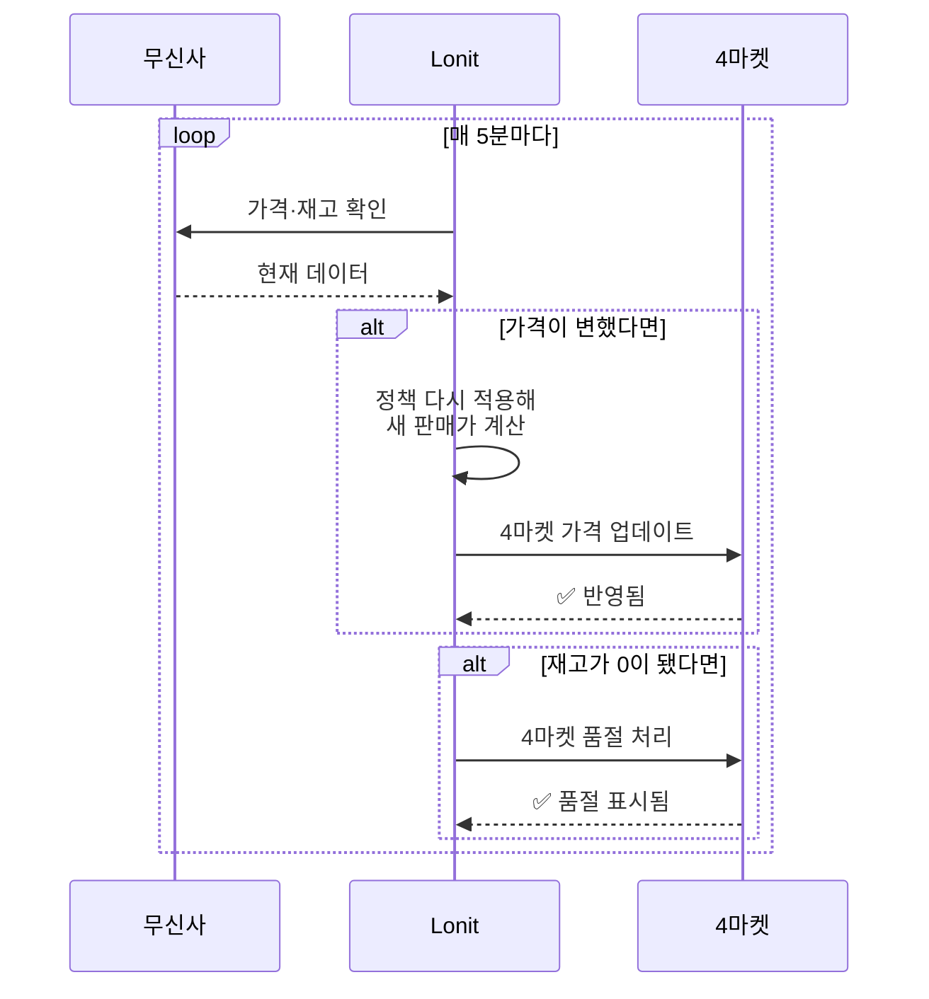
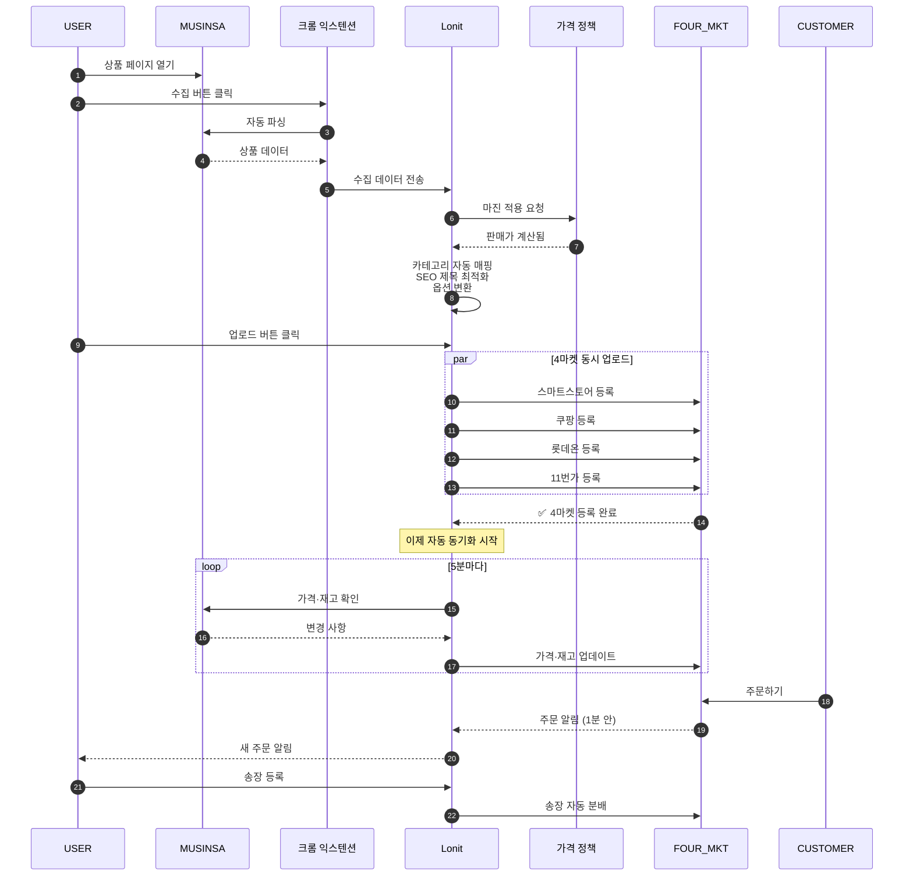
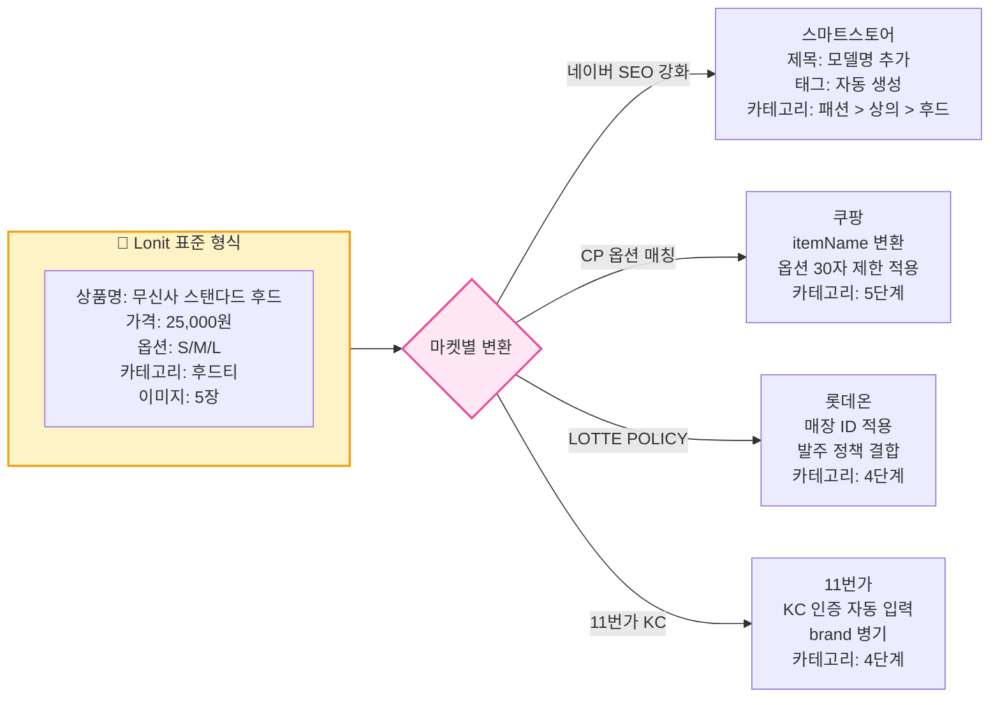
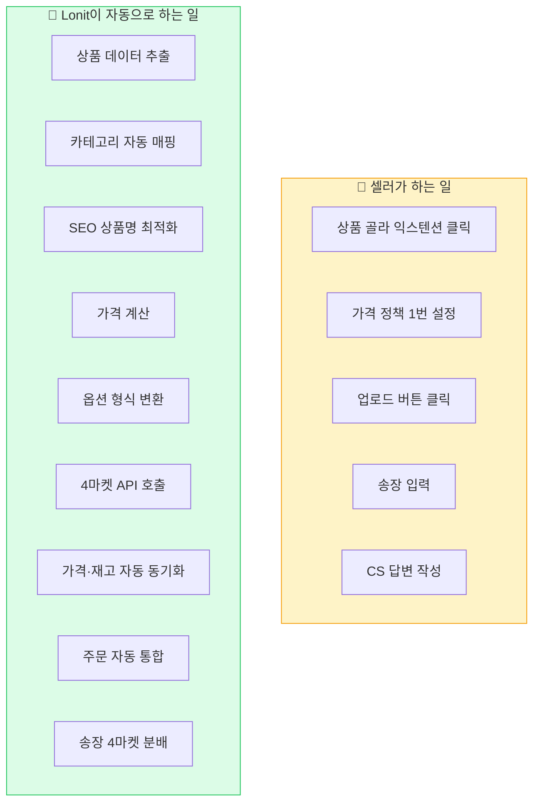
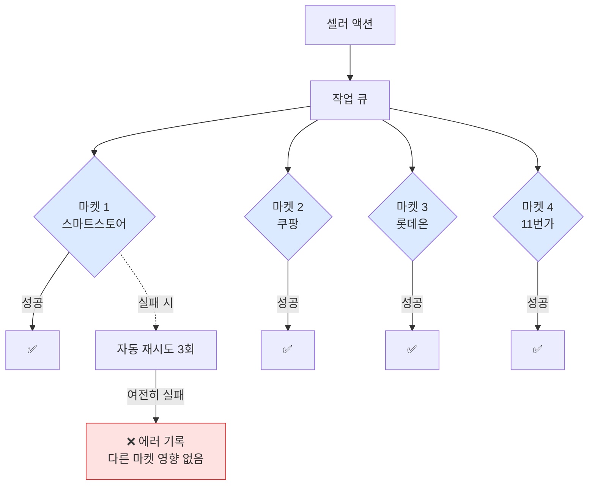

# 시스템 구조 한눈에 보기

> Lonit이 **어떻게** 동작하는지 그림으로 이해하기.

이 챕터는 코드나 어려운 용어 없이, **그림 위주로** Lonit의 동작을 설명합니다. 강의에서는 이 챕터부터 시작합니다.

---

## 1. 한 장으로 보는 Lonit

**왼쪽**(소싱처)에서 상품을 받아 **가운데**(Lonit)에서 가공한 뒤 **오른쪽**(마켓)에 보냅니다.

---

## 2. 핵심 4기능

각 기능을 하나씩 봅시다.

### 2-1. 수집 (Collect)

!!! note "수집은 곧 '복제'가 아닙니다"
    Lonit은 소싱처의 **상품 정보**를 가져옵니다. 가격·이미지·설명을 그대로 마켓에 올리는 게 아니라, [가격 정책](07-pricing.md)을 적용해 새로운 판매가를 계산하고, [SEO 최적화](04-market-strategy/smartstore.md)로 상품명을 다듬어 올립니다.

### 2-2. 등록 (Upload)

**핵심 포인트**: 4마켓은 **동시에 병렬로** 업로드됩니다. 1개 마켓이 느려도 다른 3개는 영향 없음.

### 2-3. 동기화 (Sync)

이건 Lonit의 **가장 큰 가치**입니다. 등록 후엔 아무것도 안 해도 자동.

**감지 → 적용까지 평균 5초**. 무신사에서 가격이 바뀐 뒤 5초 후엔 4마켓에도 반영되어 있습니다.

### 2-4. 주문·CS

**4개 마켓 따로 주문 받아 처리**할 필요가 없습니다. 한 화면에서 다 보고, 송장도 한 번 등록하면 4마켓에 자동 분배.

자세한 흐름은 [6. 주문 + CS](06-orders-cs.md) 참고.

---

## 3. 데이터의 일생 — 한 상품이 거치는 길

상품 1개가 무신사에서 시작해 마켓에 올라가고 주문 받기까지의 전체 흐름:

---

## 4. "왜 4마켓 동시"가 가능한가?

질문: 마켓마다 API 형식·정책·카테고리·옵션 규칙이 다 다른데, 어떻게 한 상품을 동시에 올릴 수 있을까?

**답: Lonit이 마켓별 변환을 자동으로 합니다.**

각 마켓의 **고유한 규칙은 [4. 4마켓 노출 전략](04-market-strategy/index.md)**에서 자세히 설명합니다.

---

## 5. 자동 vs 수동 — 무엇을 셀러가 하고 무엇을 Lonit이 할까

!!! tip "💡 셀러는 '결정'만 합니다"
    "어떤 상품을 올릴지", "얼마에 팔지" 같은 **결정**은 사람이. 그 외 반복 작업(매핑·변환·동기화·분배)은 모두 Lonit이.

---

## 6. 멀티마켓 동시 운영의 안전장치

4마켓을 동시에 운영하면 한 마켓이 느리거나 에러가 나도 다른 마켓에 영향 없어야 합니다. Lonit의 안전장치:

**핵심 안전장치**:

- **마켓별 독립 실행**: 한 마켓 실패가 다른 마켓 막지 않음
- **자동 재시도**: 일시적 에러(네트워크 타임아웃 등)는 3회 자동 재시도
- **속도 제한**: 마켓 API의 호출 한도(분당 N회)를 자동으로 지킴
- **계정별 격리**: 한 셀러의 작업이 다른 셀러에 영향 없음

자세한 트러블슈팅은 [8. 트러블슈팅](08-troubleshooting.md) 참고.

---

## 7. 한 줄 요약

> **Lonit = 12개 사이트 → 4마켓 → 자동 동기화** 를 한 화면에서 관리하는 컨트롤타워.

다음 챕터에서는 같은 일을 하는 **T사**와 무엇이 어떻게 다른지 봅니다.

<a class="lonit-card" href="../03-vs-others/">
🆚
<h3>3. T사와 비교</h3>

차이점·장단점·갈아타기 가이드

</a>

<a class="lonit-card" href="../04-market-strategy/">
🎯
<h3>4. 마켓별 노출 전략</h3>

알고리즘 차이 + 잘 노출되는 법

</a>

