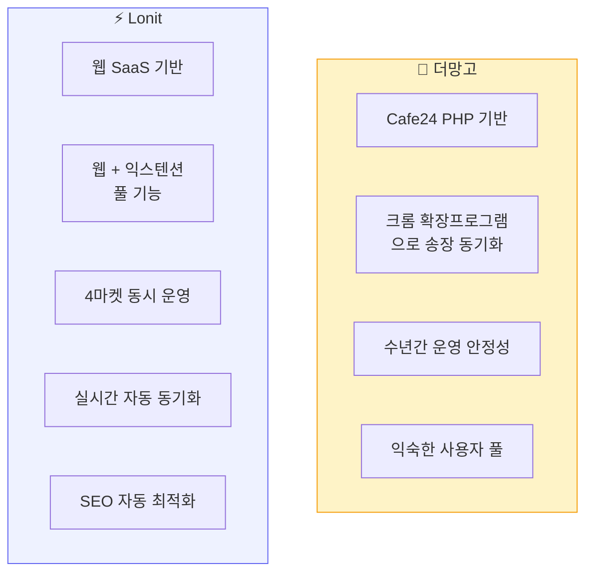
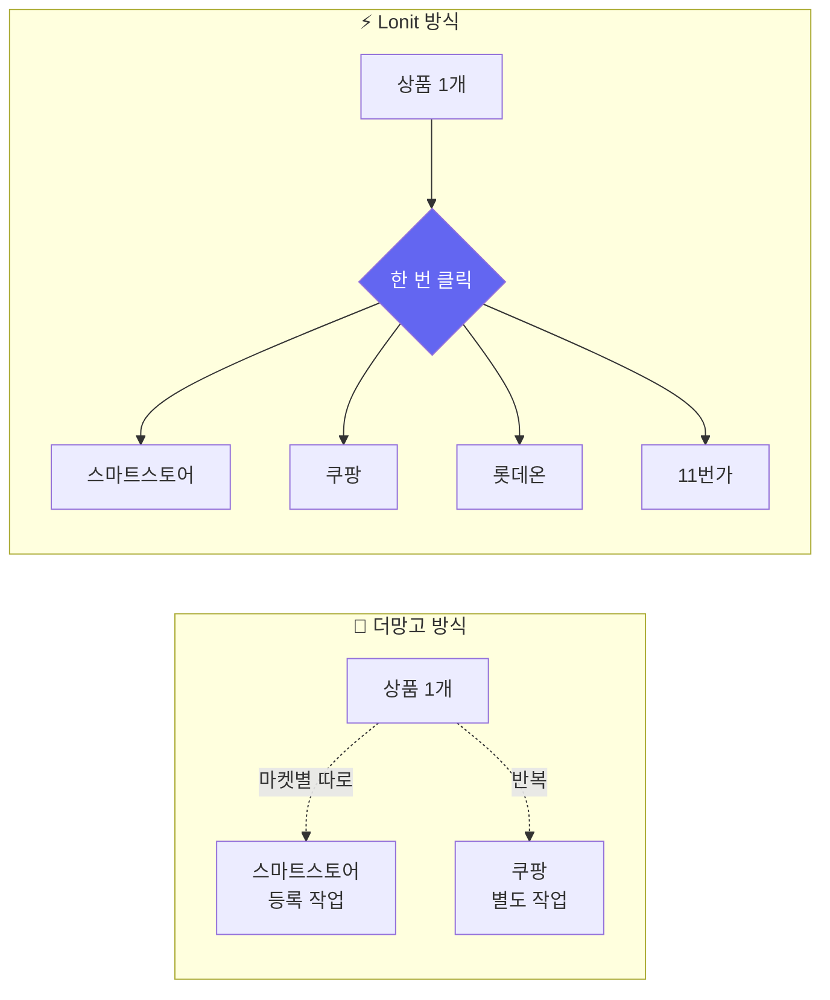
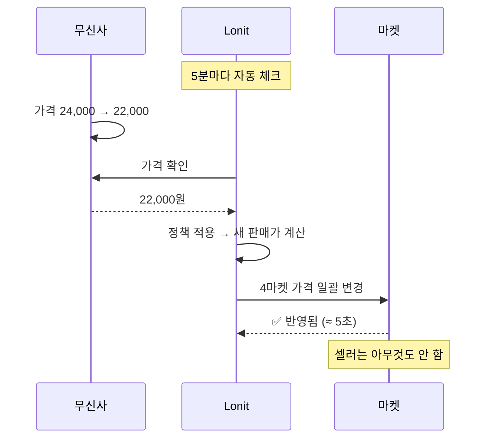
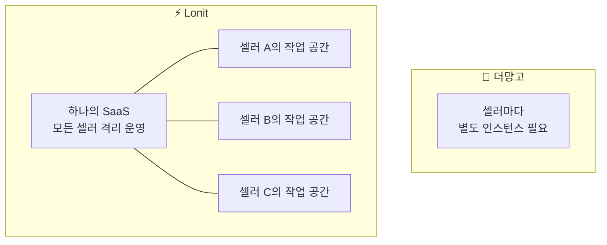

# 더망고와 무엇이 다른가

> **공정한 비교 + 갈아타기 가이드**
>
> 더망고와 Lonit은 비슷한 일을 하지만 **방식**이 다릅니다. 어느 쪽이 무조건 좋다기보다, 셀러의 상황에 따라 결정이 달라질 수 있습니다.

---

## 1. 한눈에 비교



| 항목 | 🥭 더망고 | ⚡ Lonit |
|------|---------|---------|
| **첫 출시** | 2018년 | 2026년 |
| **기반** | Cafe24 PHP 플랫폼 경유 | 자체 클라우드 SaaS |
| **상품 등록 방식** | 확장프로그램 → PHP 서버 → 마켓 | 웹 → API → 마켓 (직접) |
| **수집 속도** | 1,000건 ≈ 10분 | 1,000건 ≈ 15초 |
| **지원 마켓** | 스마트스토어 (주력), 일부 마켓 | 스마트스토어·쿠팡·롯데온·11번가 (4개 동시) |
| **SEO 최적화** | 수동 입력 | 자동 (네이버 Top5 태그 + 카테고리 학습) |
| **카테고리 매핑** | 단순 문자열 매칭 | 7단계 자동 (DB 학습 + AI 추론) |
| **가격 자동 동기화** | 수동 트리거 | 5분마다 자동 |
| **멀티 계정** | 무신사 다중 계정 ✅ | 마켓별 다중 계정 ✅ |
| **주문·CS 통합** | 10개 섹션 풀 매뉴얼 | 4마켓 통합 대시보드 |
| **결제** | Toss Payments 빌링 | Toss Payments 빌링 |

---

## 2. Lonit이 잘하는 것

### 2-1. 4마켓 동시 운영

가장 큰 차이입니다.



상품 1개 → 4마켓 등록 시간:
- **더망고**: 마켓별 폼을 따로 채워야 → 마켓당 ~5분 × 4 = 20분
- **Lonit**: 한 번 등록 → 4마켓 동시 ~30초

### 2-2. 자동 SEO 최적화 (스마트스토어 핵심)

스마트스토어는 노출이 곧 매출입니다. Lonit은 자동으로:

| 자동 최적화 | 동작 |
|----------|------|
| **상품명 SEO** | 네이버 Top5 검색어 자동 결합 (예: 후드티 + 무신사 → "남자 빅사이즈 오버핏 후드 티셔츠") |
| **태그 자동 생성** | 네이버 쇼핑 인기 태그 Top5 복사 |
| **카테고리 정확도** | 7단계 매핑 (DB 학습 → AI → 키워드 → 상품명) |
| **모델명 자동 추출** | 같은 상품 시리즈끼리 묶어 검색 노출 ↑ |
| **금지어 자동 제거** | "무신사", "스탠다드" 등 마켓 금지어 자동 필터 |

자세한 SEO 전략은 [4-2. 스마트스토어](04-market-strategy/smartstore.md) 참고.

### 2-3. 실시간 자동 동기화



더망고는 **수동**으로 가격 동기화를 트리거해야 합니다. Lonit은 5분마다 자동.

### 2-4. 빠른 수집

| 작업 | 더망고 | Lonit |
|------|--------|-------|
| 상품 1개 수집 | ~30초 (DOM 파싱) | ~1초 (API) |
| 1,000건 수집 | ~10분 | ~15초 |

대량 수집할 때 차이가 극명합니다.

### 2-5. 확장성 (멀티테넌트)



Lonit은 SaaS이므로 별도 설치가 없습니다. 가입 즉시 시작.

---

## 3. 더망고가 잘하는 것 (솔직히)

균형 있는 비교를 위해 더망고의 강점도 인정해야 합니다.

### 3-1. 오랜 운영 안정성

더망고는 **2018년부터** 운영. 수많은 셀러가 사용해 왔고, 엣지 케이스가 다 발견·수정된 상태. 신규 도구는 아무리 잘 만들어도 운영 시간만큼은 따라잡을 수 없습니다.

### 3-2. 익숙한 UI

더망고를 쓰던 셀러는 **메뉴 위치·용어·흐름**에 익숙합니다. Lonit으로 갈아타면 처음엔 헷갈릴 수 있습니다 — 이 챕터의 [4. 마이그레이션 가이드](#4)가 도움이 될 것입니다.

### 3-3. 다중 무신사 계정 운영

더망고는 한 셀러가 **여러 무신사 계정**을 한 화면에서 운영하는 기능이 매끄럽게 정리되어 있습니다. Lonit도 가능하지만, 더망고만큼 UI가 다듬어지진 않았습니다 (Phase 2 로드맵).

### 3-4. PHP 기반의 단순함

더망고는 PHP 기반이라 **단순한 구조**입니다. 디버깅이나 수정이 직관적인 면이 있습니다. (반대로 Lonit은 더 정교한 기능을 위해 더 복잡한 스택을 씁니다 — TypeScript + 멀티테넌트 PostgreSQL 등)

---

## 4. 더망고 → Lonit 마이그레이션 가이드 { #4 }

더망고를 쓰고 계셨다면, 이 섹션이 갈아타기에 도움이 됩니다.

### 4-1. 갈아타기 전 점검

```mermaid
flowchart TB
    Q1{현재 운영 중<br>마켓 수는?}
    Q1 -->|1개 마켓 (스마트스토어 only)| A1[Lonit 효과 보통]
    Q1 -->|2~4개 마켓| A2[⭐ Lonit 효과 큼<br>4마켓 동시 운영 + 송장 자동 분배]
    
    Q2{매일 등록하는<br>상품 수는?}
    Q2 -->|10건 미만| B1[Lonit 효과 보통]
    Q2 -->|50건 이상| B2[⭐ Lonit 효과 큼<br>수집·등록·동기화 자동화 효과 ↑]
    
    Q3{SEO 노출에<br>신경 쓰나요?}
    Q3 -->|수동으로 만족| C1[Lonit 효과 보통]
    Q3 -->|자동 SEO 원함| C2[⭐ Lonit 효과 큼<br>제목·태그·카테고리 자동 최적화]
    
    style A2 fill:#dcfce7,stroke:#22c55e
    style B2 fill:#dcfce7,stroke:#22c55e
    style C2 fill:#dcfce7,stroke:#22c55e
```

⭐ 가 2개 이상이면 마이그레이션 효과가 큽니다.

### 4-2. 마이그레이션 단계

```mermaid
flowchart LR
    A[1. Lonit 가입] --> B[2. 마켓 계정 등록]
    B --> C[3. 정책 설정]
    C --> D[4. 기존 상품 1개 테스트]
    D --> E[5. 결과 확인]
    E -->|만족| F[6. 점진적 이전]
    E -->|문제 있음| D
    F --> G[7. 더망고 병행 운영]
    G --> H[8. 완전 이전]
    
    style A fill:#dbeafe
    style D fill:#fef3c7,stroke:#f59e0b,stroke-width:2px
    style F fill:#fce7f3
    style H fill:#dcfce7,stroke:#22c55e,stroke-width:2px
```



**병행 운영 기간**(7번)을 두는 것을 강력 추천합니다. 1~2주 정도 두 도구를 동시에 쓰면서 Lonit이 자기 스타일에 맞는지 확인.

### 4-3. 메뉴 매핑표 (더망고 → Lonit)

더망고에서 자주 쓰던 메뉴가 Lonit에서 어디 있는지:

| 더망고 메뉴 | Lonit 위치 | 비고 |
|-----------|----------|------|
| 상품 등록 | **상품 → + 새 상품** 또는 **익스텐션 수집** | 익스텐션이 더 빠름 |
| 상품 목록 | **상품 → 목록** | 검색·필터 강화 |
| 가격 일괄 변경 | **상품 목록 → 정책 적용** | 정책 바꾸면 자동 재계산 |
| 재고 동기화 | **자동** (5분마다) | 수동 버튼도 있음 |
| 송장 등록 | **주문 → 발송** | 4마켓 자동 분배 |
| 주문 목록 | **주문** | 4마켓 통합 |
| CS 답변 | **CS** | 4마켓 통합 |
| 매출 통계 | **대시보드** + **매출** | 마켓별 비교 가능 |
| 마켓 계정 추가 | **설정 → 마켓 계정** | 4마켓 모두 지원 |
| 무신사 계정 추가 | **설정 → 소싱 계정** | 다중 계정 |
| 정책 설정 | **정책** | 가격/배송/카테고리 정책 |
| 카테고리 매핑 | **자동** (7단계 매핑) | 수동 오버라이드도 가능 |

### 4-4. 데이터 가져오기

!!! warning "직접 import 기능은 현재 없습니다"
    더망고에서 등록한 상품 정보를 Lonit으로 일괄 import하는 기능은 아직 제공하지 않습니다. 두 가지 방법:

    1. **새로 등록 (권장)**: 익스텐션으로 무신사 등에서 다시 수집. 카테고리·SEO·가격이 Lonit 방식으로 새로 최적화됨. **상품 수가 많으면 며칠 걸리지만 결과 품질이 더 좋습니다.**
    2. **마켓에 이미 등록된 상품 흡수**: Lonit은 마켓에 이미 있는 상품을 자기 작업 공간으로 가져올 수 있습니다 (catalog reconcile). 단, 이 기능은 **스마트스토어·쿠팡**만 지원하며 사용자 가이드는 [트러블슈팅](08-troubleshooting.md#기존-마켓-상품-가져오기) 참고.

### 4-5. 마이그레이션 체크리스트

- [ ] Lonit 가입 + 작업 공간 확인
- [ ] 4마켓 셀러센터에 서버 IP 등록 (158.247.214.201)
- [ ] 4마켓 API 키 발급 + Lonit에 등록 + 연결 테스트 ✅
- [ ] 무신사 계정 연결
- [ ] 가격 정책 1개 설정 (마진 30%, 최소 5,000원 권장)
- [ ] 익스텐션 설치 + 동작 확인
- [ ] 테스트 상품 1개 4마켓 업로드 → 결과 확인
- [ ] 자동 동기화 동작 확인 (가격 임의 조정 후 5분 대기)
- [ ] 첫 주문 발생 시 송장 자동 분배 확인
- [ ] 1~2주 병행 운영 후 만족 시 더망고 단계 축소

---

## 5. 솔직한 권고

> **무조건 Lonit으로 갈아타라**고 말하지는 않습니다. 다음의 경우엔 Lonit이 명확히 효과적입니다.

### Lonit이 더 나은 경우

- ✅ 2~4개 마켓을 동시에 운영
- ✅ 매일 50건 이상 등록
- ✅ SEO 노출에 시간을 못 쓰고 있음
- ✅ 가격 동기화를 수동으로 매일 돌리고 있음
- ✅ 4마켓 주문을 따로 받아 송장을 따로 입력 중
- ✅ 신규 시작이라 어차피 도구를 처음 고름

### 더망고를 그대로 두는 게 나은 경우

- ⏸️ 스마트스토어 1개만 운영
- ⏸️ 매일 5건 미만 등록
- ⏸️ 더망고에 이미 수년간 쌓인 데이터·노하우가 있고 마이그레이션 시간이 부담
- ⏸️ 새 도구 학습 시간이 곧 매출 손실

### 둘 다 쓰는 경우 (병행 운영)

- 🔁 더망고: 메인 1개 마켓 + 익숙한 무신사 계정
- 🔁 Lonit: 신규 추가 마켓 (쿠팡·롯데온·11번가) + 신규 무신사 계정

이 패턴이 가장 안전하고 효과적입니다. 점진적으로 비중을 옮기면 됩니다.

---

## 다음 단계

<div class="lonit-cards">

<a class="lonit-card" href="../04-market-strategy/">
<span class="lonit-card-icon">🎯</span>
<h3>4. 4마켓 노출 전략</h3>
<p>각 마켓에서 잘 노출되는 법 — Lonit의 가장 큰 차별점</p>
</a>

<a class="lonit-card" href="../01-getting-started/">
<span class="lonit-card-icon">🚀</span>
<h3>1. 5분 빠른 시작</h3>
<p>지금 바로 가입 → 첫 상품 등록</p>
</a>

</div>
