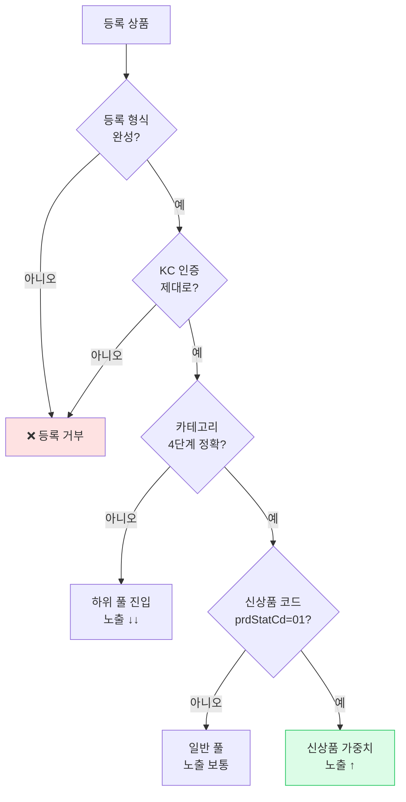
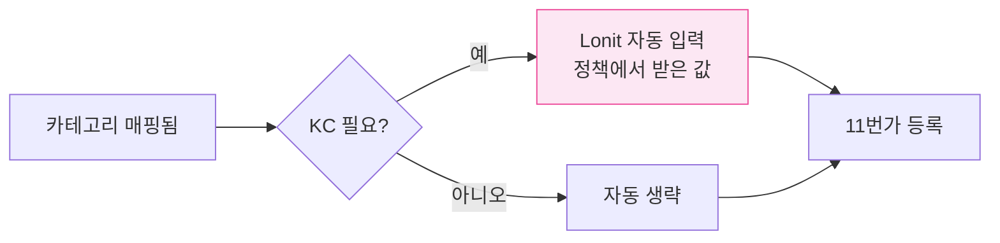
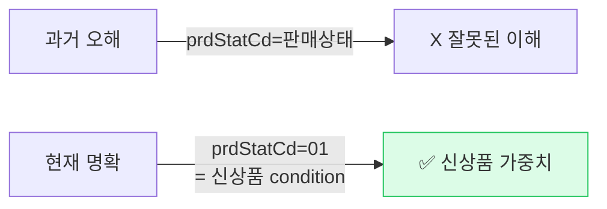
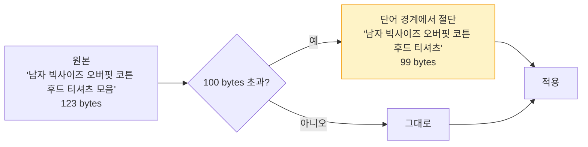
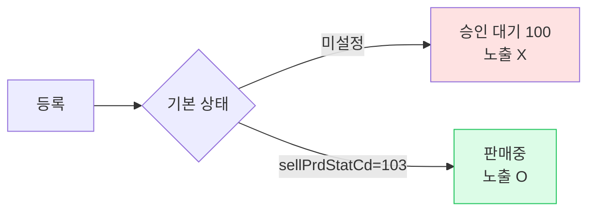
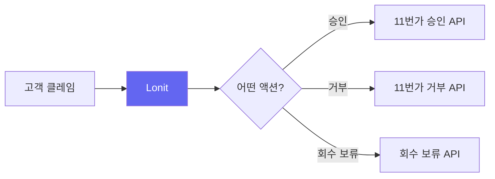

# 11번가 노출 전략

> **등록 형식 완성도가 곧 노출**. KC 인증, 신상품 코드, 카테고리 — 하나라도 빠지면 안 됨.

<span class="market-badge eleven">11번가</span>

---

## 1. 11번가의 노출 결정 요인



11번가는 **형식 검증**이 가장 까다롭습니다. 형식이 맞으면 노출, 안 맞으면 거부.

---

## 2. KC 인증 — 등록 거부의 가장 큰 원인

KC 인증(국내 안전 인증)은 카테고리에 따라 필수입니다.

### 2-1. KC 인증 필요한 카테고리 (예시)

| 카테고리 | KC 인증 필요? |
|---------|------------|
| 의류 | 일부 (영유아·아동 등) |
| 신발 | 영유아 신발만 |
| 전자제품 | 거의 모두 ✅ |
| 화장품 | 일부 |
| 식품 | 별도 인증 |
| 가방 | 보통 X |

### 2-2. Lonit이 자동 처리



### 2-3. 셀러가 해야 할 일

KC 인증 정보(인증번호, 인증기관)는 **정책 → 11번가 인증 정보** 에서 1번 입력해두면 됩니다.

| 항목 | 입력 |
|------|------|
| KC 인증번호 | 셀러가 발급받은 번호 (또는 면제 사유) |
| 인증기관 | 한국기계전기전자시험연구원 등 |
| 인증연도 | YYYY |

---

## 3. 신상품 코드 — 신상 가중치

11번가는 **신상품 코드(`prdStatCd=01`)**를 받은 상품에 노출 가중치를 더 줍니다.

### 3-1. 헷갈리는 부분



`prdStatCd=01` 은 **판매상태가 아니라 신상품 표시** 입니다.

### 3-2. 자동 처리

Lonit은 **새로 수집된 모든 상품에 `prdStatCd=01`** 을 자동으로 붙입니다. 셀러가 신경 쓸 필요 없음.

---

## 4. 상품명 — 100바이트 제한

11번가는 상품명을 **UTF-8 100바이트**까지 받습니다. 한글은 보통 3바이트 → 약 33자.

### 4-1. Lonit 자동 절단



자동 절단 시 단어가 잘려 의미 손실이 없도록 **단어 경계**에서 자릅니다.

---

## 5. 브랜드 병기 — 노출에 영향

11번가는 **브랜드를 상품명에 함께** 표시하면 검색 매칭이 좋아집니다.

```
"남자 빅사이즈 오버핏 코튼 후드 티셔츠"
                  ↓
"무신사스탠다드 남자 빅사이즈 오버핏 코튼 후드"
```

Lonit은 자동으로 브랜드를 상품명 앞에 붙입니다. **단, 무신사·스탠다드 같은 금지어는 제외** (다른 마켓 정책 동일).

---

## 6. 카테고리 — 4단계 + 검색 풀

11번가도 4단계 카테고리. Lonit이 자동 매핑.

```
패션 > 남성의류 > 상의 > 후드티
```

### 6-1. 카테고리 bulk 매핑

여러 상품의 카테고리를 한 번에 매핑할 때:

**상품 목록 → 다중 선택 → "카테고리 자동 매핑"**

이건 Lonit이 자동으로 한 번에 처리합니다 — 셀러는 다중 선택 후 "카테고리 자동 매핑" 버튼만 누르면 됩니다.

---

## 7. 판매상태 — 등록 후 즉시 판매중

11번가는 등록 직후 **판매중(selPrdStatCd=103)** 상태로 들어가야 노출됩니다.



Lonit은 등록 시 자동으로 `sellPrdStatCd=103` 을 보냅니다. 별도 확인 없이 바로 판매중으로 들어감.

---

## 8. CS 처리 — 클레임 액션

11번가는 클레임(취소/반품/교환) 처리 API가 정교합니다. Lonit은 [CS 통합](../06-orders-cs.md) 챕터에서 자세히 다룹니다.



자세히는 6장.

---

## 9. 판매기간 — 시작일/종료일

11번가는 판매 기간을 **`aplBgnDy` (시작일) + `aplEndDy` (종료일)** 형태로 받습니다.

| 필드 | Lonit 자동 |
|------|---------|
| `aplBgnDy` | 등록 당일 |
| `aplEndDy` | 1년 후 (정책에서 변경 가능) |

---

## 10. 자주 발생하는 문제 { #troubleshooting }

### 10-1. "KC 인증 필요" 에러

해결: 정책에 KC 인증 정보 입력. 또는 KC 면제 카테고리로 재매핑.

### 10-2. 상품명 100바이트 초과 거부 (해결됨)

현재는 자동 절단으로 해결됩니다. 그래도 발생하면 [트러블슈팅](../08-troubleshooting.md) 참고.

### 10-3. "신상품 가중치 못 받는 듯"

`prdStatCd=01` 누락 가능성. 자동 적용되지만 수정된 상품의 경우 누락될 수 있음. 재등록으로 해결.

---

## 11. 요약 체크리스트

11번가 노출 잘 되려면:

- [ ] KC 인증 정보 정책에 입력
- [ ] 카테고리 4단계 정확
- [ ] `prdStatCd=01` 자동 (신상품 가중치)
- [ ] `sellPrdStatCd=103` 자동 (판매중)
- [ ] 상품명 100바이트 이내 (자동 절단)
- [ ] 브랜드 병기 (금지어 제외)
- [ ] 판매기간 자동 (1년 default)

---

## 12. 4마켓 모두 끝내고 나서

축하합니다! 4마켓 노출 전략을 다 봤습니다. 이제 일상 운영 챕터로:

<div class="lonit-cards">

<a class="lonit-card" href="../../05-workflow/">
<span class="lonit-card-icon">🔄</span>
<h3>5. 일상 워크플로우</h3>
<p>매일 어떻게 운영하는지 — 수집·등록·동기화 흐름</p>
</a>

<a class="lonit-card" href="../../06-orders-cs/">
<span class="lonit-card-icon">📦</span>
<h3>6. 주문 + CS</h3>
<p>4마켓 주문 통합·송장·클레임</p>
</a>

<a class="lonit-card" href="../../07-pricing/">
<span class="lonit-card-icon">💰</span>
<h3>7. 가격 정책</h3>
<p>마진 공식·정책 우선순위</p>
</a>

</div>
