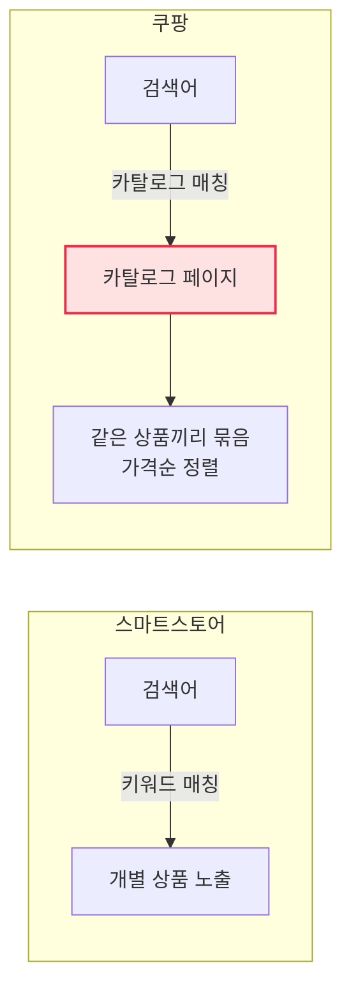
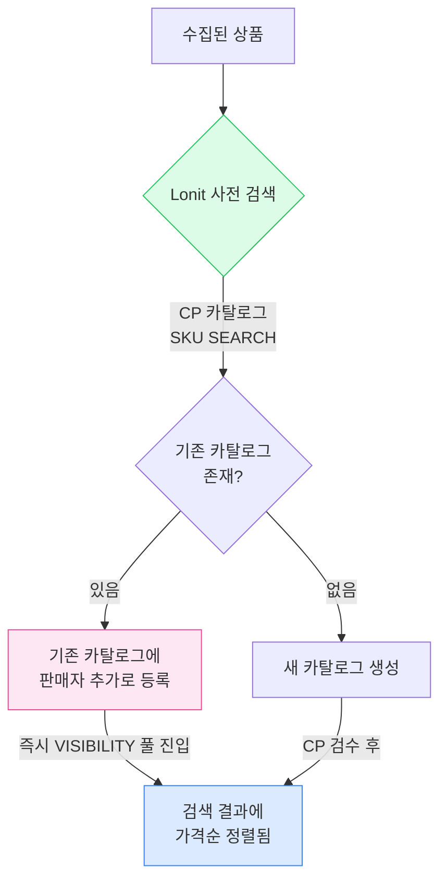
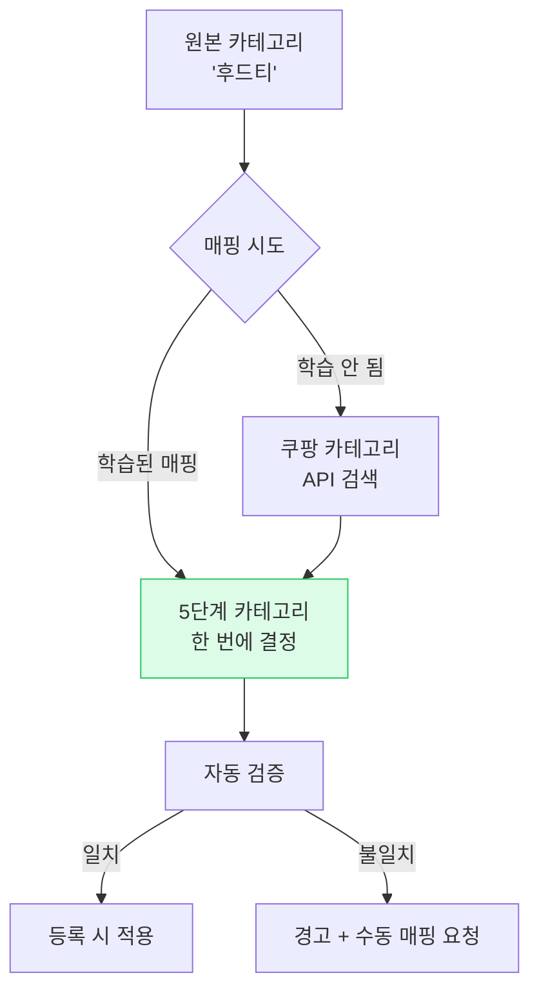
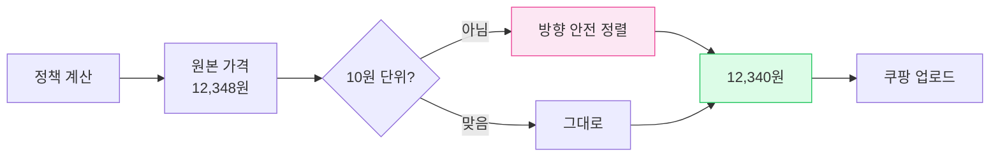
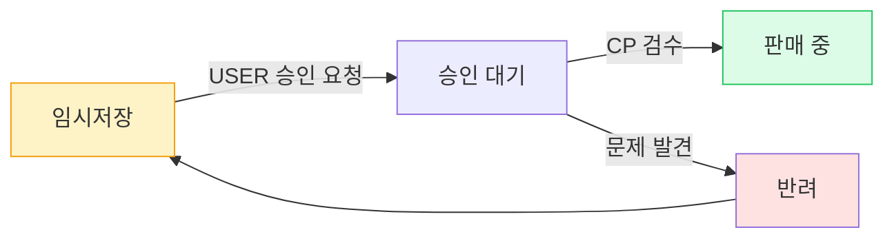
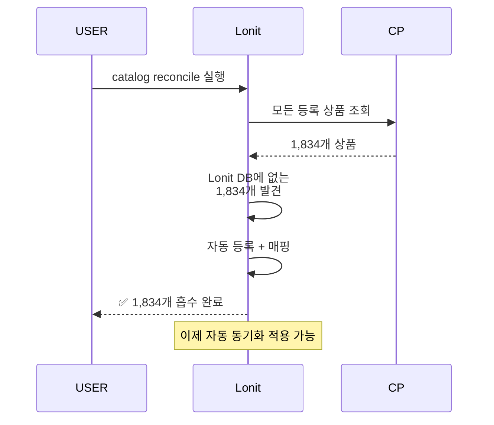

# 쿠팡 노출 전략

> **카탈로그가 곧 노출**. 같은 상품끼리 묶이는 카탈로그에 들어가야 합니다.

<span class="market-badge coupang">쿠팡</span>

---

## 1. 쿠팡이 다른 마켓과 결정적으로 다른 점

스마트스토어처럼 검색 키워드 매칭이 핵심이 아닙니다.



쿠팡은 같은 상품을 **하나의 카탈로그 페이지**로 묶고, 그 안에서 **셀러끼리 가격 경쟁**시킵니다. 그래서:

- ✅ 카탈로그에 잘 들어가면 → 노출 풀 진입
- ❌ 카탈로그에 못 들어가면 → "기타" 처리되어 노출 거의 없음

---

## 2. 카탈로그 매칭 — 가장 중요한 자동화



### 2-1. SKU 사전 검색이란?

Lonit은 등록 전에 **상품의 SKU 코드로 쿠팡 카탈로그를 검색**합니다. 같은 상품이 이미 있으면 그 카탈로그에 합류해서 즉시 노출 풀에 들어갑니다.

이걸 **preflight SKU 검색**이라 부르며, 기본으로 **켜져 있습니다**.

!!! tip "💡 PreFlight SKU 검색의 효과"
    같은 무신사 후드티를 100명의 셀러가 등록하면, 모두가 같은 카탈로그 페이지에 들어갑니다. 가격으로 경쟁하지만, 적어도 **검색 풀에는 모두 나타납니다**. 새 카탈로그를 따로 만들면 처음엔 노출 0건.

---

## 3. 카테고리 — 5단계 정확히 맞추기

쿠팡 카테고리는 **5단계 깊이**입니다. 한 단계만 틀려도 다른 풀로 빠집니다.

```
패션의류 / 남성의류 / 상의 / 후드티/맨투맨 / 후드티
```

### 3-1. Lonit 카테고리 자동 매칭



### 3-2. 카테고리 미매핑 시 결과

| 매핑 상태 | 결과 |
|---------|------|
| ✅ 정확한 5단계 | 검색 풀 정상 진입, 노출 양호 |
| ⚠️ 잘못된 카테고리 | 다른 풀로 빠져 노출 거의 없음 |
| ❌ 매핑 실패 | 등록 자체가 실패 |

---

## 4. 옵션 매칭 — 자주 막히는 부분

쿠팡은 옵션값에 엄격한 규칙이 있습니다.

### 4-1. 옵션값 길이 30자 제한

```mermaid
flowchart LR
    SOURCE[원본 옵션값<br>'멀티/4-5(130~160)'] --> Check{30자 초과?}
    Check -->|예| Trim[자동 줄임<br>'멀티']
    Check -->|아니오| Pass[그대로 사용]
    
    Trim --> Apply[적용]
    Pass --> Apply
    
    Apply --> Coupang[쿠팡 등록]
    
    style Trim fill:#fef3c7,stroke:#f59e0b
```

**옵션값 30자 초과 시 등록 거부**됩니다. Lonit은 자동으로 줄여 보내지만, 의미가 사라질 수 있어 사전에 옵션명 정리를 하는 게 좋습니다.

### 4-2. 옵션 슬롯 — 색상 vs 사이즈

쿠팡은 옵션을 보통 **색상 + 사이즈** 2축으로 받습니다.

| 원본 형태 | Lonit 변환 |
|---------|---------|
| `검정/L`, `흰색/L`, `검정/M` | 색상 ✕ 사이즈 (2축) |
| `S`, `M`, `L` | 사이즈만 (1축) |
| `프리` | 옵션 없음 (단일 SKU) |

### 4-3. 옵션 매칭 자주 발생하는 함정

| 문제 | Lonit 자동 처리 |
|------|--------------|
| 옵션값 30자 초과 | 자동 줄임 |
| 키즈 사이즈 (2T, 3T 등) | 토들러 슬롯 자동 라우팅 |
| 색상 단어 경계 (예: "베이지" → "이지" 매칭 오탐) | 단어 경계 정확화 |
| 사이즈에 범위 표기 (130~160) | 범위 패턴 인식 |

---

## 5. 가격 — 정확히 10원 단위

쿠팡은 **가격이 1원 단위면 거부**합니다. 예:

```
❌ 12,345원 (1원 단위) → 쿠팡 거부
✅ 12,340원 (10원 단위) → 정상 등록
```

### 5-1. Lonit 가격 단위 정렬



**방향 안전 정렬**: 마진 손실을 막기 위해 항상 **올림** 또는 **내림** 중 정책에 맞는 방향으로만 정렬.

### 5-2. 정책 가격 단위 설정

[7. 가격 정책](../07-pricing.md) 에서 `priceUnit` 을 `10` 또는 `100` 으로 설정해두면 쿠팡 거부가 발생하지 않습니다.

---

## 6. 로켓 노출 가능성

쿠팡의 **로켓 배송**은 자체 풀필먼트 센터(쿠팡 창고)에 입고된 상품에만 적용됩니다. Lonit은 일반 셀러 발송 상품을 등록하므로:

- ❌ **로켓 배송**은 Lonit으로 자동화 못 함
- ✅ **일반 배송 셀러**로 정상 등록되어 노출 풀 진입

로켓 노출이 매출에 결정적이면 쿠팡 풀필먼트(JFS, 제트배송) 별도 신청이 필요합니다.

---

## 7. 임시저장 → 승인요청 → 노출 활성화

쿠팡은 등록 후 **3단계 상태**를 거칩니다:



### 7-1. Lonit의 일괄 승인요청 기능

임시저장된 상품이 쌓이면 한 번에 승인 요청할 수 있습니다.

**대시보드 → 쿠팡 임시저장 목록 → 일괄 승인요청 버튼**

이 기능 덕에 쿠팡 등록 후 별도 셀러센터 작업이 거의 없습니다.

### 7-2. 승인 안 되는 경우

| 반려 사유 | 해결 |
|---------|------|
| 카테고리 부적합 | 카테고리 재매핑 |
| 옵션 형식 오류 | 옵션명 30자 이내 줄임 |
| 이미지 부족 | 추가 이미지 업로드 |
| 상품명 형식 위반 | itemName 표준 형식 검토 |

---

## 8. 동기화 시 발생하는 함정 { #troubleshooting }

### 8-1. 마켓에는 있는데 Lonit에 없는 상품 (orphan)

쿠팡 셀러센터에 직접 등록한 상품이 **Lonit에 없으면** 가격·재고 동기화에서 누락됩니다.

해결: **catalog reconcile** 기능으로 자동 흡수.



자세한 가이드는 [트러블슈팅](../08-troubleshooting.md#쿠팡-orphan) 참고.

### 8-2. PENDING (승인 대기) 동기화 차단

승인 대기 중인 상품에 가격 동기화를 시도하면 쿠팡이 거부합니다. Lonit은 PENDING 상태는 자동으로 동기화에서 제외하므로 셀러가 신경 쓸 필요 없음.

---

## 9. 요약 체크리스트

쿠팡 노출 잘 되려면:

- [ ] 카테고리 정확한 5단계
- [ ] SKU preflight 검색 → 기존 카탈로그 합류
- [ ] 옵션값 30자 이내
- [ ] 가격 10원 단위
- [ ] 정확한 itemName 형식
- [ ] 임시저장 후 승인요청 잊지 말기
- [ ] orphan 상품은 catalog reconcile 로 흡수

---

<div class="lonit-cards">

<a class="lonit-card" href="../lotteon/">
<span class="lonit-card-icon">🏪</span>
<h3>다음: 롯데온 전략</h3>
<p>정책 시스템 + 발주 + 가격</p>
</a>

<a class="lonit-card" href="../">
<span class="lonit-card-icon">🎯</span>
<h3>4마켓 비교 보기</h3>
<p>다른 마켓들과 비교</p>
</a>

</div>
