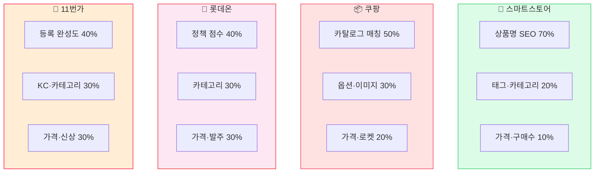
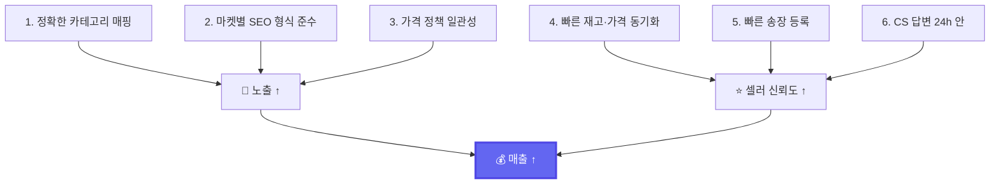
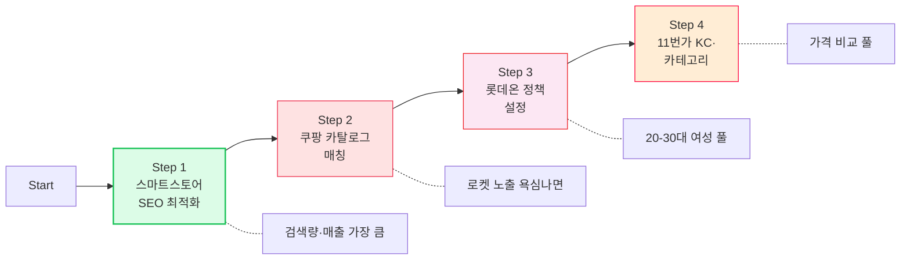

# 4마켓 노출 전략 — 한눈에 비교

> 사용자가 가장 자주 묻는 챕터. **각 마켓이 무엇을 보고 노출 순위를 정하는지** 이해하면, Lonit이 왜 그렇게 동작하는지 보입니다.

---

## 1. 한 줄 요약

| 마켓 | 노출 핵심 |
|------|---------|
| **🛒 스마트스토어** | **검색 SEO** — 상품명·태그·카테고리·키워드가 정답에 얼마나 일치하는가 |
| **📦 쿠팡** | **카테고리 일치 + 옵션 매칭** — 카탈로그 카테고리에 정확히 들어갔는가 |
| **🏪 롯데온** | **정책 점수 + 가격 경쟁력** — 매장 정책이 마켓 룰에 얼마나 부합하는가 |
| **🎁 11번가** | **카테고리 + KC 인증 + 신상품 가중치** — 등록 형식 완성도 |

각 마켓의 **상세 알고리즘**과 **Lonit이 자동으로 처리하는 부분**은 아래 챕터에서 따로 설명합니다.

---

## 2. 마켓별 알고리즘 비교

**숫자는 대략적 비중입니다** — 각 마켓이 공식 비공개. 운영 경험과 패턴 분석 기반.

---

## 3. 마켓별 함정 한눈에

### ❌ 자주 하는 실수 vs ✅ Lonit이 자동으로 막는 것

| 마켓 | 자주 하는 실수 | Lonit 자동 대응 |
|------|------------|--------------|
| **스마트스토어** | "무신사" "스탠다드" 등 마켓 금지어 사용 → 노출 차단 | 자동 필터 + 동의어 치환 |
| **스마트스토어** | 카테고리 잘못 지정 → 검색 풀에서 빠짐 | 7단계 매핑 (DB 학습 + AI) |
| **스마트스토어** | 태그를 안 채움 → 노출 50% 손실 | Top5 추천 태그 자동 입력 |
| **쿠팡** | 옵션값 30자 초과 → 등록 실패 | 자동 줄임 + 필수 옵션 채움 |
| **쿠팡** | 카테고리 미매핑 → "기타" 폴백 → 노출 거의 없음 | 카탈로그 매칭 + 카테고리 검색 |
| **쿠팡** | itemName 형식 안 맞음 → 큐 정체 | 표준 형식 자동 변환 |
| **롯데온** | 정책 ID 누락 → 발주 거부 | 정책 자동 매핑 |
| **롯데온** | 매장 ID 미입력 → 등록 실패 | 매장 ID 자동 적용 |
| **11번가** | KC 인증 미입력 → 등록 거부 | 카테고리별 KC 자동 입력 |
| **11번가** | 상품명 100바이트 초과 → 거부 | UTF-8 자동 절단 |
| **11번가** | 신상품 코드 누락 → 신상 가중치 못 받음 | `prdStatCd=01` 자동 |
| **공통** | 가격 단위 1원 → 일부 마켓 거부 | 정책 가격 단위 자동 정렬 |

---

## 4. 4마켓 노출 잘 되는 셀러의 공통 행동

이 6가지를 셀러가 직접 하면 시간이 많이 들지만, **Lonit이 1·2·4·5를 자동화**합니다. 셀러는 3과 6에 집중하면 됩니다.

---

## 5. 우선순위 — 어디부터 노출 잘 되게 할까?

신규 셀러의 경우:

**스마트스토어**가 검색량·매출이 가장 크므로 SEO 최적화에 가장 신경 써야 합니다. 다른 3개 마켓은 카테고리·정책·KC만 잘 맞추면 노출 자체는 큰 차이 없이 됩니다.

---

## 마켓별 자세히 보기

<a class="lonit-card" href="../smartstore/">
🛒
<h3>스마트스토어</h3>

검색 SEO + 카테고리 + 태그 — 가장 중요한 마켓

</a>

<a class="lonit-card" href="../coupang/">
📦
<h3>쿠팡</h3>

카탈로그 매칭 + 옵션 + 로켓 가능성

</a>

<a class="lonit-card" href="../lotteon/">
🏪
<h3>롯데온</h3>

정책 시스템 + 발주 + 가격

</a>

<a class="lonit-card" href="../11st/">
🎁
<h3>11번가</h3>

KC 인증 + 카테고리 + 신상품 가중치

</a>

