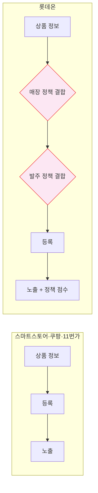
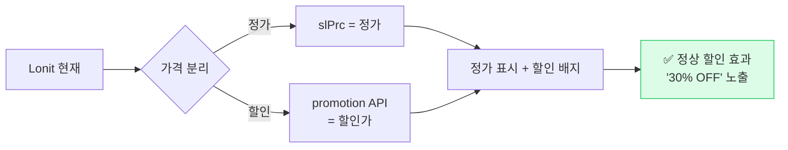
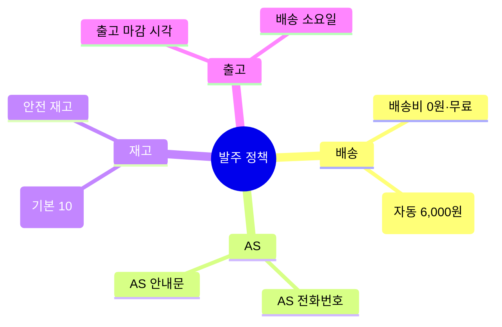
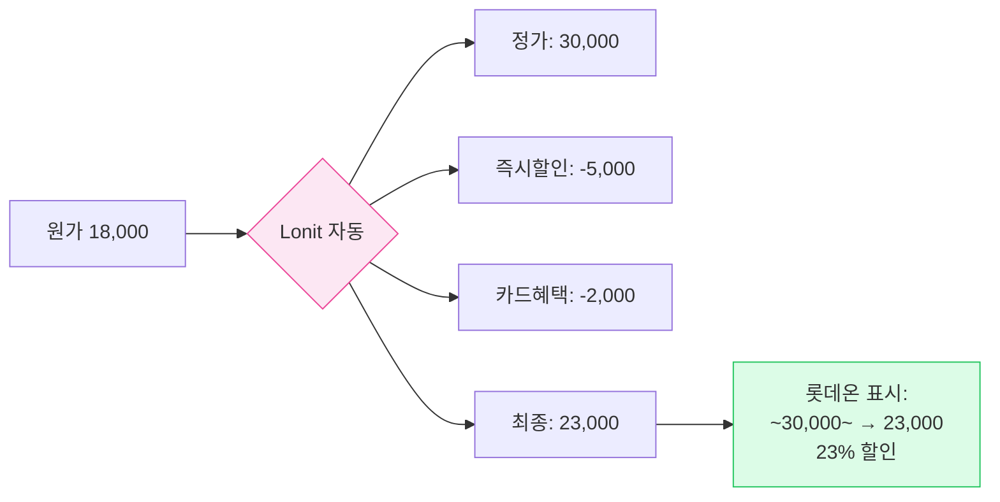
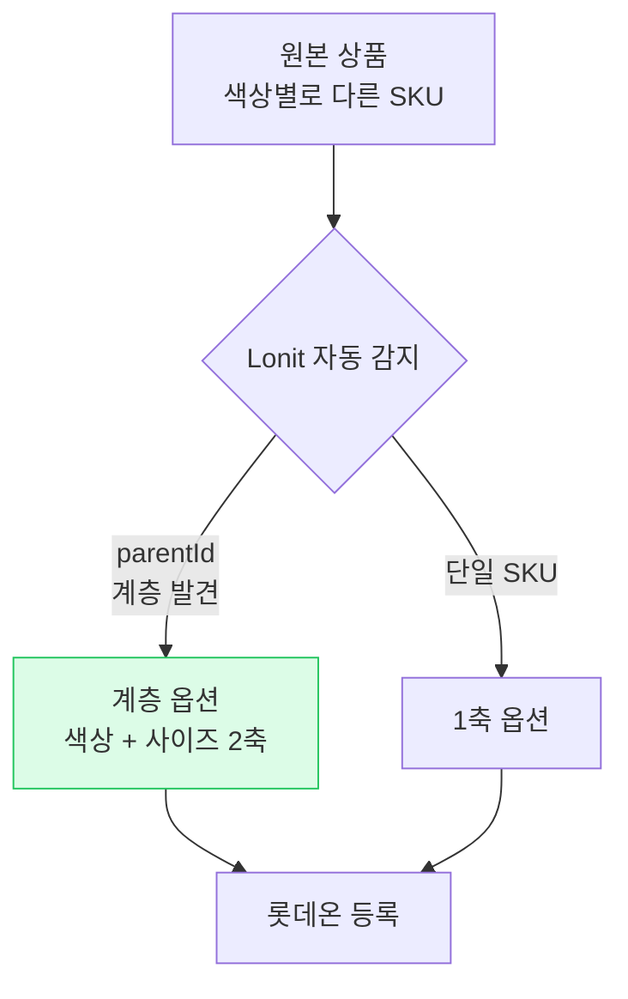
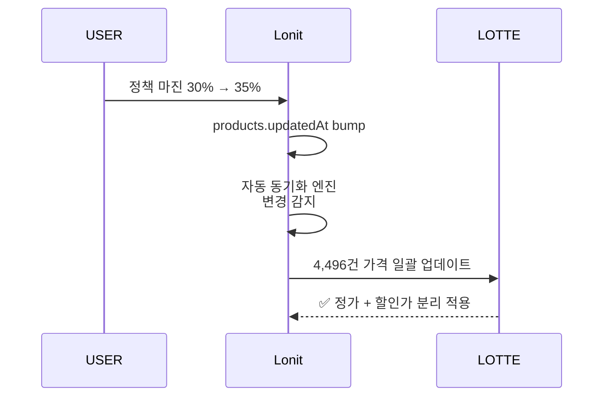

# 롯데온 노출 전략

> **정책이 곧 노출**. 매장 정책 + 발주 정책 + 카테고리가 다 맞아야 합니다.

<span class="market-badge lotteon">롯데온</span>

---

## 1. 롯데온이 다른 마켓과 다른 점



롯데온은 **상품 + 정책의 조합**으로 등록합니다. 정책 설정이 잘못되면 발주가 거부됩니다.

---

## 2. 매장 ID — 가장 먼저 확인

각 셀러는 **매장 ID**를 받습니다. 이 ID가 없으면 등록 자체가 안 됩니다.


매장 ID는 **롯데온 셀러센터 → 매장 관리** 에서 확인 가능합니다.

---

## 3. 가격 — 정가 + 할인가 분리

롯데온은 **정가(slPrc)** 와 **할인가(promotion)** 가 분리되어 있습니다. 다른 마켓과 가장 큰 차이.

### 3-1. 잘못된 이해 (과거 버그)


### 3-2. 올바른 처리 (현재)



이 로직은 자동입니다. 셀러는 정책에 마진과 할인을 설정만 하면 Lonit이 알아서 두 가지로 분리해 등록합니다.

### 3-3. 가격 효과 비교

| 등록 방식 | 표시 결과 | 클릭률 |
|---------|--------|------|
| 정가만 표시 | 25,000원 | 보통 |
| **정가 + 할인 분리** | ~~30,000원~~ → **25,000원** (16% 할인 배지) | ⭐ 높음 |

---

## 4. 카테고리 — 4단계

롯데온은 **4단계 카테고리** 입니다.

```
패션 / 남성 / 상의 / 후드티
```

스마트스토어·쿠팡보다 한 단계 얕음. Lonit이 자동 매핑합니다.

---

## 5. 발주 정책 — 등록 거부의 가장 큰 원인

롯데온은 **발주 정책**을 모든 상품에 결합해야 합니다.

### 5-1. 발주 정책에 들어가는 것



### 5-2. Lonit이 자동 적용

매장 ID를 등록한 상태에서 정책을 1번 만들면, **모든 상품에 자동 적용**됩니다.

| 항목 | 기본값 (Lonit 설정) |
|------|----------------|
| 배송비 | 무료 (3만원 이상 무료 등) |
| 반품 배송비 | 6,000원 (정책에서 변경 가능) |
| 교환 배송비 | 6,000원 |
| 최대 재고 | 10개 (정책에서 변경 가능) |
| AS 안내 | "구매처 문의" |
| 출고 | 평일 14시 마감 |

[7. 가격 정책](../07-pricing.md) 챕터에서 정책 변경 방법 설명.

### 5-3. 발주 거부 사유

| 사유 | 해결 |
|------|------|
| 매장 ID 누락 | 설정 → 마켓 계정에서 매장 ID 입력 |
| 정책 ID 누락 | 정책 매핑 자동 (Lonit이 처리) |
| 가격 0원 | 정책 마진 검토 (판매가 > 0 보장) |
| 배송지 미설정 | 출고지·반품지 자동 등록 (lotteon 셀러센터에서 1회 설정) |

---

## 6. 카드 혜택 — 노출에 영향

롯데온은 **롯데카드·신한카드 등의 카드 혜택**이 노출 가중치에 영향을 줍니다. Lonit은 이 부분을 자동으로 처리:

- 카드 혜택 가격은 **이미 적용된 가격**으로 보임
- Lonit이 즉시할인 + 카드 혜택을 분리해 등록
- 셀러는 정책에서 할인율만 설정하면 됨



---

## 7. 옵션 — 2축까지 자동 변환

롯데온도 **색상 + 사이즈** 2축까지 정상 처리합니다.

### 7-1. parentId 계층 자동 감지



같은 상품의 색상 변형들을 자동으로 인식해 2축 옵션으로 등록합니다.

---

## 8. 동기화 — 정책 변경 시 자동 반영

가격 정책을 바꾸면 롯데온 등록된 상품 가격도 **5분 안에** 자동 변경됩니다.



---

## 9. 자주 발생하는 문제 { #troubleshooting }

### 9-1. "발주 거부"

대부분 매장 ID 또는 정책 ID 누락. **설정 → 마켓 계정 → 롯데온** 에서 매장 ID 확인.

### 9-2. "할인 표시 안 됨"

과거 슬PRC 정가/판매가 혼동 버그가 있었으나 현재 fix 완료. 만약 여전히 안 보이면 [트러블슈팅](../08-troubleshooting.md) 참고.

### 9-3. "재고 100인데 마켓에는 10"

기본 정책의 최대 재고가 10. 정책에서 `maxStock` 을 100으로 늘리면 됨.

---

## 10. 요약 체크리스트

롯데온 등록 잘 되려면:

- [ ] 매장 ID 정확
- [ ] 발주 정책 1개 설정 (배송비·AS·재고)
- [ ] 출고지·반품지 셀러센터에서 1회 설정
- [ ] 가격 정책 (정가 + 할인 자동 분리)
- [ ] 카테고리 4단계 정확
- [ ] 옵션 2축 (색상 + 사이즈)

---

<div class="lonit-cards">

<a class="lonit-card" href="../11st/">
<span class="lonit-card-icon">🎁</span>
<h3>다음: 11번가 전략</h3>
<p>KC 인증 + 카테고리 + 신상품</p>
</a>

<a class="lonit-card" href="../">
<span class="lonit-card-icon">🎯</span>
<h3>4마켓 비교 보기</h3>
<p>다른 마켓들과 비교</p>
</a>

</div>
