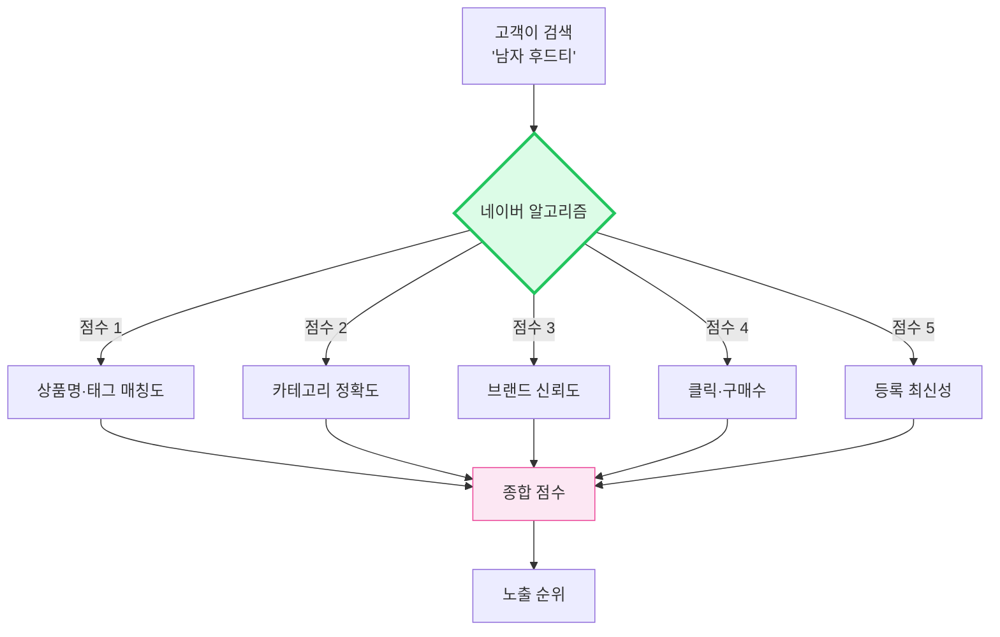
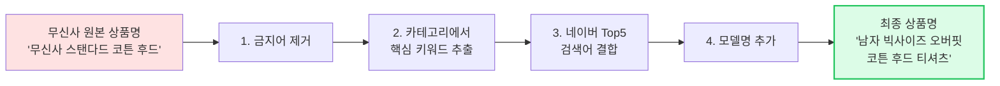
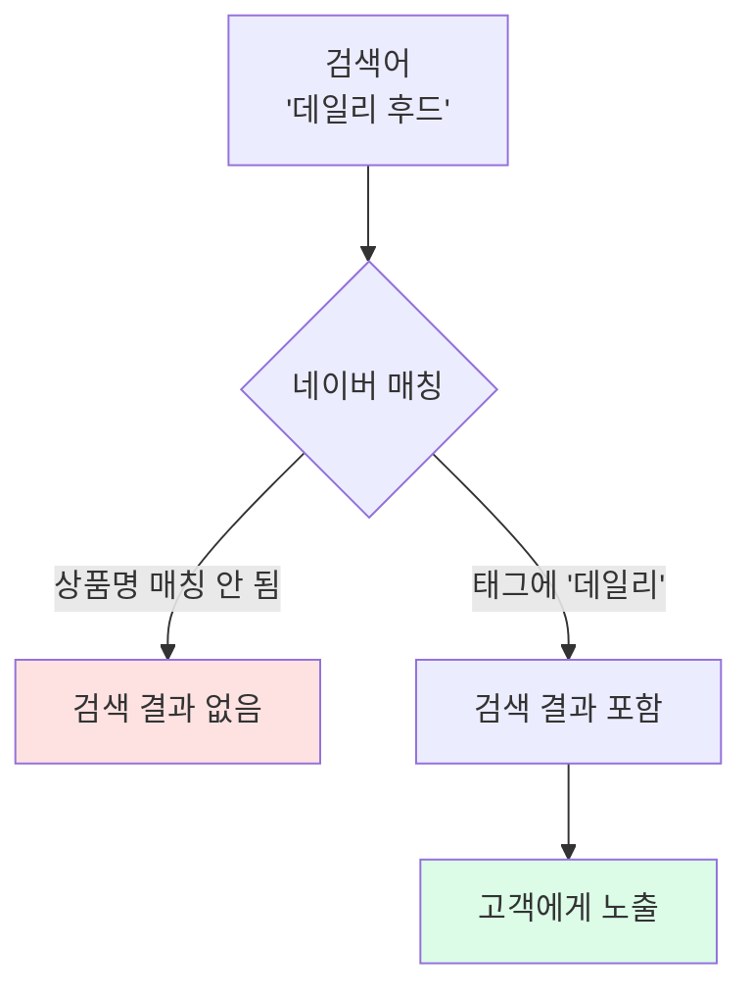
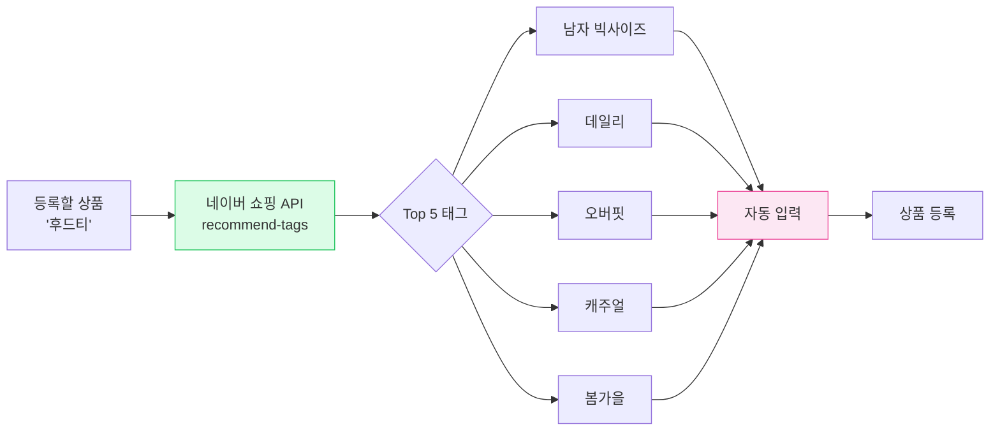
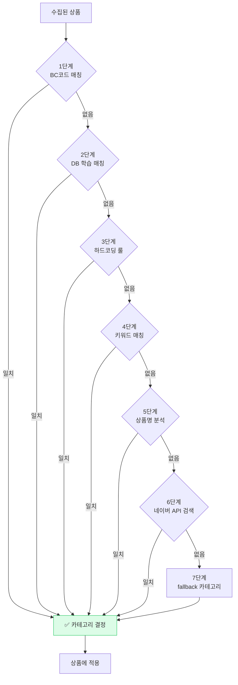
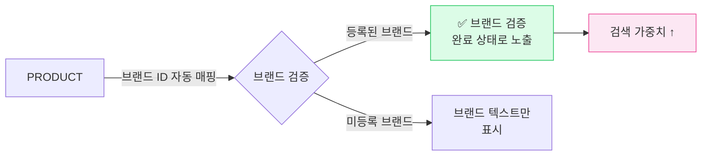
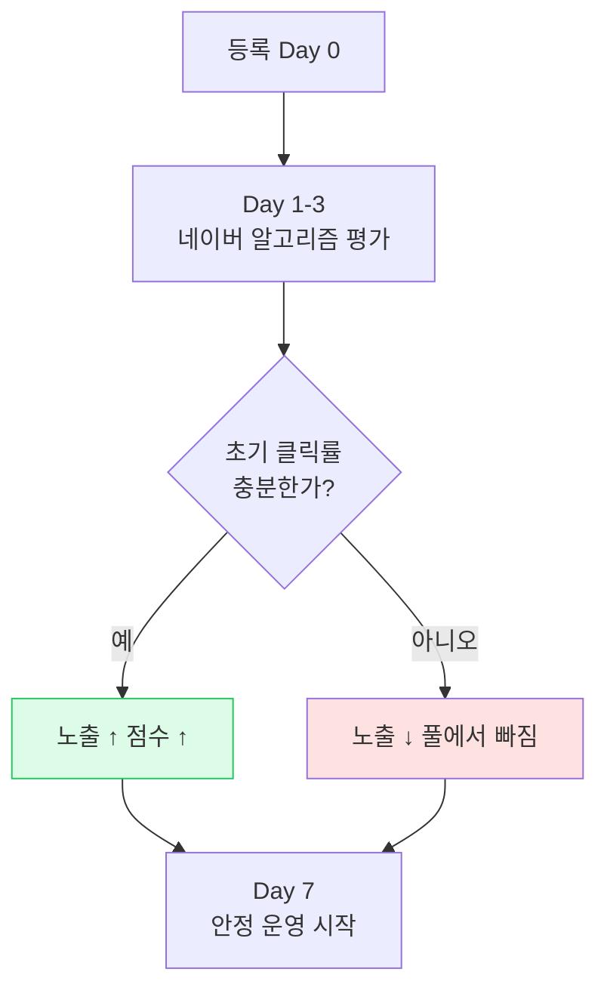
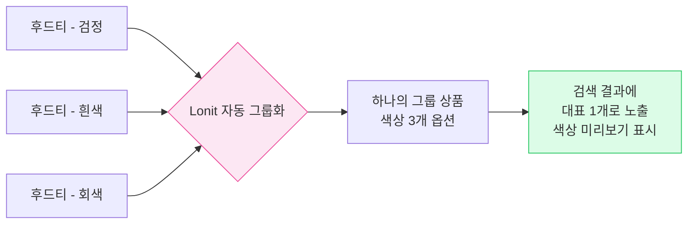

# 스마트스토어 노출 전략

> **검색이 곧 매출**. 네이버 검색에 잘 잡히는 게 가장 중요한 마켓.

<span class="market-badge smartstore">스마트스토어</span>

---

## 1. 스마트스토어가 노출 순위를 정하는 방식



신규 상품은 **점수 4(클릭·구매수)와 점수 5(최신성)에 의존도 높음**. 처음엔 1·2·3을 잘 맞춰서 노출 풀에 들어가야 합니다.

---

## 2. 노출의 핵심 — 상품명 SEO

스마트스토어 노출의 **70%는 상품명**에서 결정됩니다.

### 2-1. 좋은 상품명 vs 나쁜 상품명

=== "❌ 나쁜 예"

    ```
    무신사 스탠다드 코튼 후드 NM-2024
    ```
    
    문제점:
    
    - "무신사" "스탠다드" → **금지어**, 노출 차단
    - "NM-2024" → 검색되지 않는 모델명
    - 핵심 키워드(남자, 빅사이즈, 오버핏 등)가 없음

=== "✅ 좋은 예"

    ```
    남자 빅사이즈 오버핏 코튼 후드 티셔츠 모음
    ```
    
    좋은 점:
    
    - "남자" "빅사이즈" "오버핏" → **고검색량 키워드**
    - "코튼" → 소재 검색 대응
    - "모음" → 옵션 다양함 표현
    - 자연스러운 한국어

### 2-2. Lonit이 자동으로 만드는 상품명



셀러가 한 일: **익스텐션 클릭 1번**. 나머지는 Lonit이 자동.

### 2-3. 상품명 길이 가이드

| 항목 | 권장 |
|------|------|
| 길이 | 50~80자 (네이버는 100자까지 허용) |
| 핵심 키워드 위치 | 앞에서 30자 안 |
| 모델명 | 끝부분에 1개 |
| 특수문자 | 최소화 (한글·영문·숫자 위주) |

---

## 3. 태그 — 노출 풀의 절반을 결정

### 3-1. 태그가 왜 중요한가

상품명에 다 못 넣은 키워드를 **태그로** 보충합니다. 네이버는 태그를 보고도 검색에 매칭합니다.



### 3-2. Lonit이 자동 입력하는 태그 5개



태그도 셀러가 직접 입력할 필요 없이 네이버 쇼핑 인기 태그를 자동으로 가져옵니다.

### 3-3. 태그 함정 (Lonit이 자동 회피)

- ❌ 금지어 태그 ("무신사", "스탠다드", "무탠다드", "남자옷", "스니커즈", "청바지" 등)
- ❌ 너무 긴 태그 (10자 이상)
- ❌ 중복 태그
- ❌ 의미 없는 단어 ("좋아요", "추천")

---

## 4. 카테고리 매핑 — 7단계 자동화



**7단계가 다 동작해야** 카테고리 매핑이 정확합니다. 하나라도 빠지면 잘못된 카테고리로 등록됨.

### 4-1. 자주 발생하는 카테고리 함정 (수정됨)

| 원본 | 잘못된 매핑 (과거) | 올바른 매핑 (현재) |
|------|-----------------|----------------|
| 서류가방 | 러닝화 ❌ | 가방 → 서류가방 ✅ |
| 원피스 | 남성니트 ❌ | 여성의류 → 원피스 ✅ |
| 캐리어 | 백팩 ❌ | 가방 → 캐리어 ✅ |

이 종류의 함정은 Lonit 운영 중 발견된 후 자동 수정됩니다.

---

## 5. 브랜드 — 매출에 큰 영향



### 5-1. 브랜드 검증 효과

스마트스토어에서 브랜드가 검증되면:

- ✅ 검색 결과에서 **브랜드명 강조 표시**
- ✅ "브랜드 신뢰도" 점수 가산
- ✅ 카테고리 베스트 진입 가능성 ↑

### 5-2. Lonit의 브랜드 자동 매핑 4단계

1. **메모리 캐시**: 직전 등록한 브랜드 매핑 즉시 사용
2. **DB 학습**: 같은 셀러가 과거 등록한 브랜드 검색
3. **하드코딩**: 자주 쓰는 브랜드 ID 매핑 (무신사스탠다드 = 257967 등)
4. **네이버 API 검색**: 브랜드명으로 네이버에서 자동 검색

!!! note "📌 셀러는 신경 안 써도 됩니다"
    네이버 검색 노출에 잡히려면 브랜드 정보가 정확한 위치에 들어가야 하는데, Lonit이 알아서 처리합니다. 다른 도구 쓰던 셀러가 "브랜드 검증이 안 보이는데?" 라고 할 때 — 보통 그 도구가 잘못된 위치에 넣어서 그렇습니다.

---

## 6. 가격·이미지 — 보조 점수

### 6-1. 가격

- **쿠폰적용가와 판매가를 동일하게** 등록 (Lonit이 자동 처리)
- 가격 단위는 가격 정책의 설정에 따름 (보통 100원 단위)

### 6-2. 이미지

- **대표 이미지 1장 + 추가 이미지 9장까지**
- 첫 이미지가 검색 결과에 보임 → 가장 깔끔한 이미지 선택
- 무신사 같은 소싱처의 모델 컷이 일반적으로 좋음
- 흰 배경 누끼 컷이 카테고리에 따라 좋을 수 있음

---

## 7. 등록 후 운영 — 클릭·구매수 끌어올리기

신규 상품은 등록 후 **첫 7일이 가장 중요**합니다.



### 7-1. 첫 7일 동안 할 일

- ✅ **광고 약간 돌리기** (검색 광고 1~2일)
- ✅ **SNS 공유** (인스타·블로그)
- ✅ **친구 구매 유도** (찐 후기 1~2개)
- ❌ **자체 클릭 자작 (어뷰징)** — 적발 시 노출 영구 차단

### 7-2. 안정기 — Lonit이 자동으로 유지

| 작업 | Lonit 자동 |
|------|----------|
| 가격 동기화 (소싱처 변경 시) | ✅ 5분마다 |
| 재고 동기화 (품절·재입고) | ✅ 5분마다 |
| 옵션 추가·삭제 | ✅ 자동 반영 |
| 등록 시간 갱신 (재노출) | ✅ 정책 변경 시 자동 |

---

## 8. 스마트스토어 특화 — 그룹 상품

색상 옵션이 많은 상품은 **그룹 상품**으로 등록하면 노출이 더 좋습니다.



Lonit은 상품명에 `[색상]` 패턴이 2개 이상이면 자동으로 그룹 상품으로 등록합니다.

---

## 9. 자주 발생하는 문제 { #troubleshooting }

### 977건 suspended 상태 — 카테고리/속성 매핑 오류 { #smartstore-suspended }

수집된 상품 일부가 **suspended (검수 중지)** 상태로 떠 있는 경우, 대부분 SSG에서 가져온 상품의 카테고리 매핑이 정확하지 않아서입니다.

해결: **카테고리 수동 재매핑** 후 재업로드.
자세한 가이드는 [트러블슈팅](../08-troubleshooting.md#smartstore-suspended) 참고.

### 가격이 다르게 보임

스마트스토어 검색 결과에서 보이는 가격과 등록 가격이 다른 경우, **쿠폰적용가와 판매가가 따로** 설정된 경우입니다. Lonit은 항상 둘을 동일하게 맞추지만, 셀러센터에서 직접 수정하면 차이가 생깁니다.

---

## 10. 요약 체크리스트

스마트스토어 노출 잘 되려면 — Lonit이 자동으로 처리하지만 셀러가 알아두면 좋은 것들:

- [ ] 상품명 50~80자, 핵심 키워드 앞에
- [ ] 금지어("무신사" 등) 안 들어감
- [ ] 카테고리 정확
- [ ] 태그 5개 (네이버 추천 태그)
- [ ] 브랜드 검증 완료
- [ ] 대표 이미지 깔끔
- [ ] 가격 정책 일관 (쿠폰적용가 = 판매가)
- [ ] 등록 후 첫 7일 광고/공유로 클릭률 끌어올림
- [ ] 색상 다중 옵션 → 그룹 상품으로 묶임

---

<div class="lonit-cards">

<a class="lonit-card" href="../coupang/">
<span class="lonit-card-icon">📦</span>
<h3>다음: 쿠팡 전략</h3>
<p>카탈로그 매칭 + 옵션 + 로켓</p>
</a>

<a class="lonit-card" href="../">
<span class="lonit-card-icon">🎯</span>
<h3>4마켓 비교 보기</h3>
<p>다른 마켓들 알고리즘과 비교</p>
</a>

</div>
