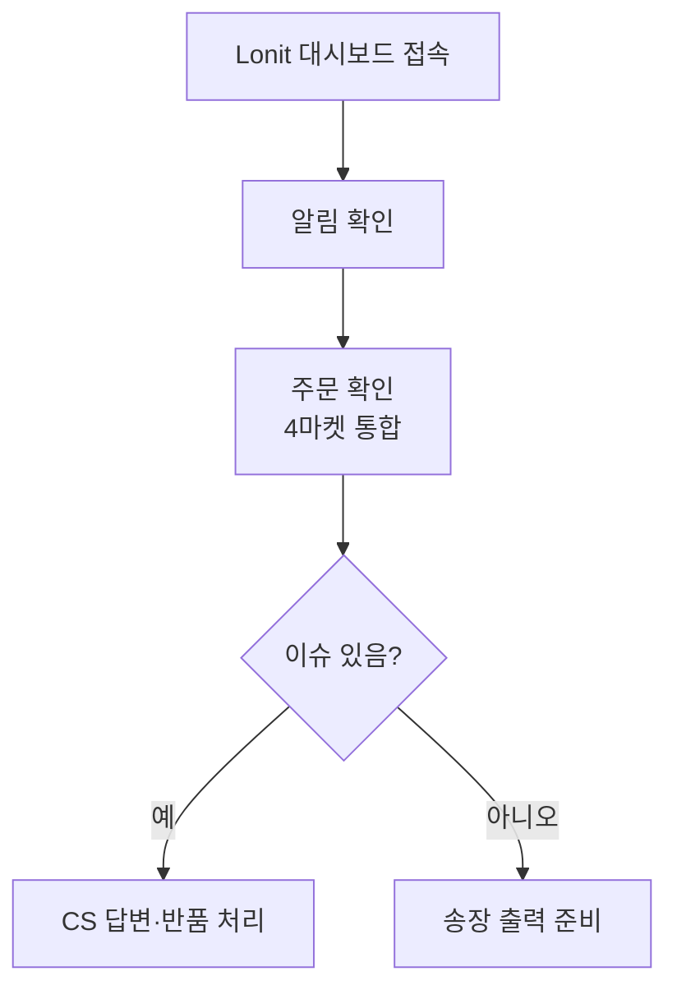
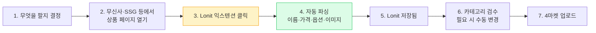
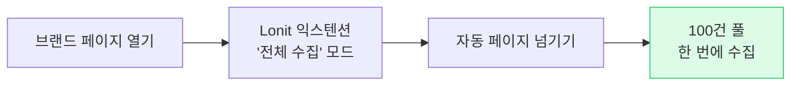
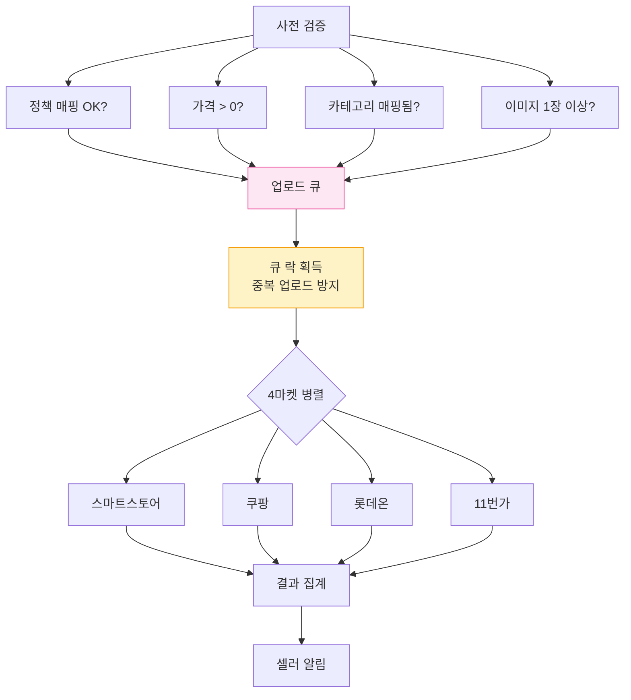
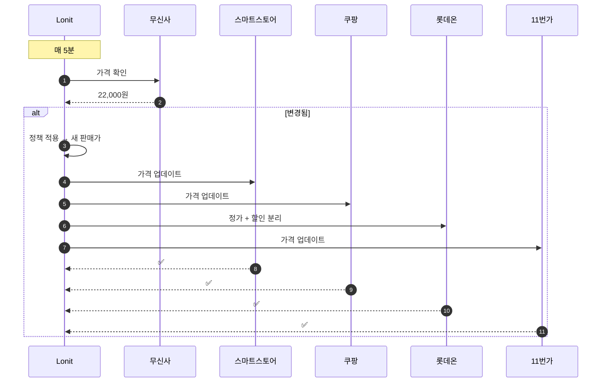
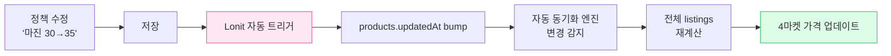

# 일상 워크플로우

> 매일 매주 매월 — Lonit을 어떤 흐름으로 사용하는가.

이 챕터는 **운영 중인 셀러**의 실제 흐름을 정리합니다. 신규 사용자는 [1. 시작하기](01-getting-started.md)부터 보세요.

---

## 1. 한 주의 흐름

```mermaid
gantt
    title 일주일 운영 패턴
    dateFormat HH:mm
    axisFormat %H:%M
    
    section 월요일
    소싱 + 수집           :a1, 09:00, 2h
    카테고리 매핑 검수     :a2, 11:00, 30m
    4마켓 업로드          :a3, 11:30, 30m
    
    section 화-금
    주문 처리             :b1, 09:00, 1h
    송장 등록             :b2, 14:00, 30m
    CS 답변               :b3, 15:00, 30m
    
    section 토요일
    매출 리뷰             :c1, 10:00, 1h
    정책 조정             :c2, 11:00, 30m
    
    section 일요일
    시즌 상품 기획         :d1, 14:00, 2h
```



매일 4~6시간 정도면 충분. **자동화된 부분(가격/재고 동기화, 카테고리 매핑, SEO)이 시간을 가장 많이 절약합니다.**

---

## 2. 매일 하는 일 — 30분 운영

### 2-1. 아침 (09:00 — 1시간)



### 2-2. 점심 (14:00 — 30분)

- 송장 등록 (4마켓 자동 분배)
- 발송 처리 → 자동 동기화

### 2-3. 오후 (16:00 — 30분)

- CS 답변 (네이버 톡톡, 11번가 문의 등 — Lonit 통합 화면)
- 신규 클레임 검수

자동 동기화 덕분에 **가격·재고는 신경 쓸 필요 없음**.

---

## 3. 수집 흐름 (Collect)

새 상품을 추가하는 과정.



### 3-1. 익스텐션 단축키

브라우저에서 키보드만으로:

| 단축키 | 동작 |
|------|------|
| Lonit 아이콘 클릭 | 상품 수집 |
| Ctrl+Shift+L | 빠른 수집 (등록된 단축키) |

### 3-2. 대량 수집 — 한 번에 100건

특정 브랜드의 모든 상품을 한 번에 수집:



`bulk-collect` 명령은 분당 ~30건 처리.

### 3-3. 수집 자동 정책 (선택)

특정 브랜드/카테고리를 **자동으로 매일 수집**할 수도 있습니다:

- **수집 정책 → + 새 정책**
- 브랜드 + 카테고리 + 가격 범위 설정
- 매일 새벽 3시 자동 실행

---

## 4. 등록 흐름 (Upload)



### 4-1. 큐 락 — 중복 업로드 방지

같은 상품을 **한 번에 한 셀러만** 업로드 가능. 다른 동기화 프로세스가 동시에 건드리지 못합니다.

큐가 30분 이상 처리 안 되면 자동으로 정리(sweep)됩니다.

### 4-2. 시뮬레이션 모드

실제 업로드 전에 검증만 돌리려면:

**상품 → 업로드 → 시뮬레이션** 체크.

이러면 마켓에 실제 등록은 안 하고 카테고리 매핑·가격·옵션 검증만 수행. 에러 메시지로 사전 점검 가능.

---

## 5. 동기화 흐름 (Sync)

이건 **셀러가 신경 쓸 필요 없는** 자동 흐름이지만, 알아두면 좋습니다.

### 5-1. 가격 동기화 (5분 주기)



### 5-2. 재고 동기화

| 상황 | Lonit 동작 |
|------|---------|
| 무신사 재고 100 → 0 | 4마켓 모두 품절 처리 |
| 무신사 재고 0 → 50 | 4마켓 모두 재고 50으로 복구 |
| 옵션 추가 | 4마켓 옵션 추가 + 매핑 |
| 옵션 삭제 | 4마켓 옵션 삭제 |

### 5-3. 동기화 모니터링

**대시보드 → 동기화 현황** 에서 실시간 확인:

- 최근 1시간 동기화 건수
- 실패 건수 (있을 경우 트러블슈팅 필요)
- 마지막 동기화 시각

대부분 셀러는 이 화면을 안 봐도 됩니다 — 자동 동작.

---

## 6. 정책 변경 흐름



정책 1개를 수정하면 **모든 적용 상품의 가격이 자동 재계산**됩니다.

### 6-1. 정책별 적용 우선순위

```
상품별 개별 정책
    ↓
검색 필터별 정책
    ↓
카테고리별 정책
    ↓
기본 정책
```

위에서 아래로 검사하다 매치되는 첫 번째 정책 적용.

---

## 7. 시즌 운영 — 월간 흐름

### 7-1. 월초 (1~5일)

- 신상 시즌 분석
- 베스트셀러 카테고리 정책 조정
- 광고 예산 배분

### 7-2. 중간 (6~25일)

- 일상 운영 (수집·등록·동기화·CS)
- 매출 점검 (주 1회)

### 7-3. 월말 (26~31일)

- 매출 리포트 작성
- 부진 상품 정리 (재고 0 처리·삭제)
- 다음 달 시즌 기획

---

## 8. 알림과 관제

### 8-1. 받을 수 있는 알림

| 알림 | 조건 | 채널 |
|------|------|------|
| 새 주문 | 4마켓 주문 발생 | Lonit 대시보드 + (옵션) 이메일 |
| 동기화 실패 | 5회 이상 연속 실패 | 대시보드 |
| 정책 변경 영향 | 1,000건 이상 가격 재계산 | 대시보드 |
| 마켓 API 다운 | 마켓 응답 1분 이상 없음 | 대시보드 |

### 8-2. 관제 대시보드

**대시보드 메인 화면**에서 한눈에:

- 4마켓 등록 상품 수 (마켓별 매트릭스)
- 오늘 주문 수
- 동기화 현황
- 최근 실패 (있을 경우)

---

## 9. 자주 하는 작업 단축

| 작업 | 단축 위치 |
|------|--------|
| 어제 주문 다시 보기 | 주문 → 어제 |
| 송장 일괄 등록 | 주문 → 다중 선택 → 송장 입력 |
| 특정 카테고리 일괄 가격 조정 | 정책 → 카테고리별 정책 → 적용 |
| 부진 상품 일괄 삭제 | 상품 → 매출 0 필터 → 다중 선택 → 삭제 |
| 재고 0 일괄 품절 처리 | 자동 (셀러 별도 작업 X) |

---

## 다음 단계

<div class="lonit-cards">

<a class="lonit-card" href="../06-orders-cs/">
<span class="lonit-card-icon">📦</span>
<h3>6. 주문 + CS</h3>
<p>주문 통합·송장·클레임 처리</p>
</a>

<a class="lonit-card" href="../07-pricing/">
<span class="lonit-card-icon">💰</span>
<h3>7. 가격 정책</h3>
<p>마진 공식·정책 우선순위</p>
</a>

</div>
