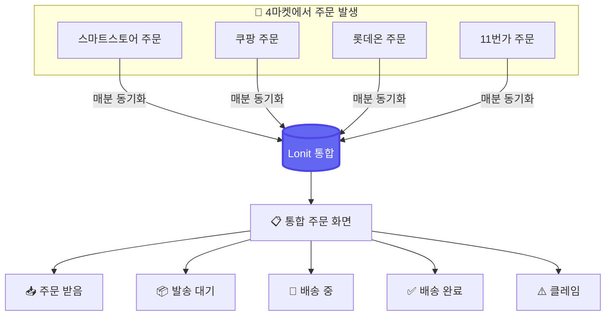
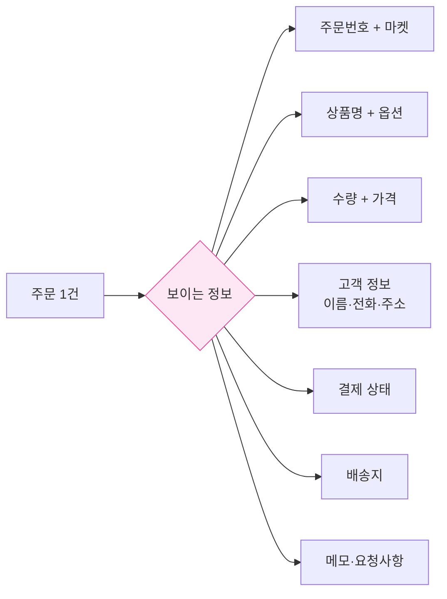
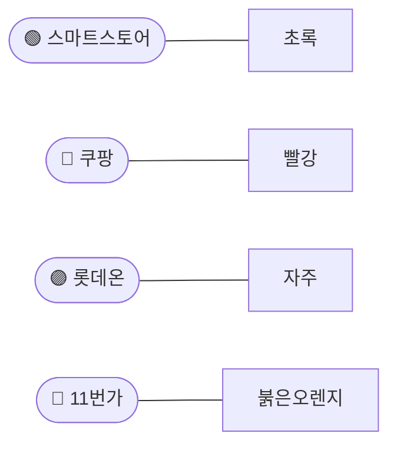
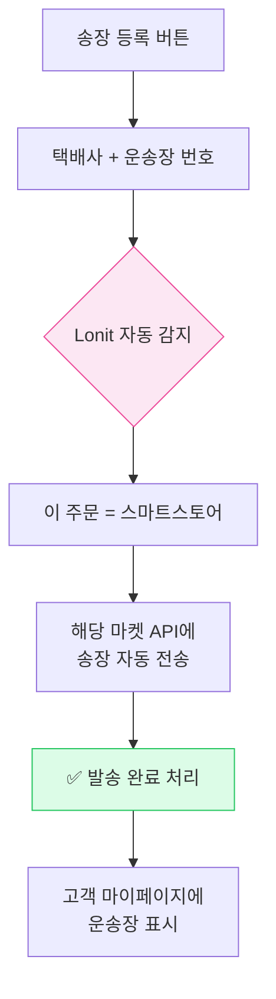
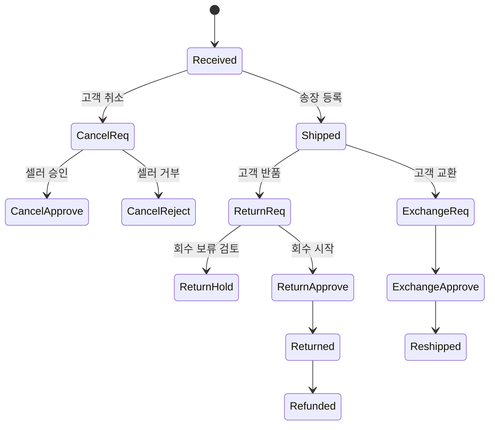
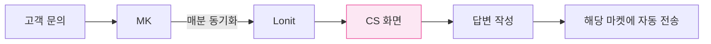
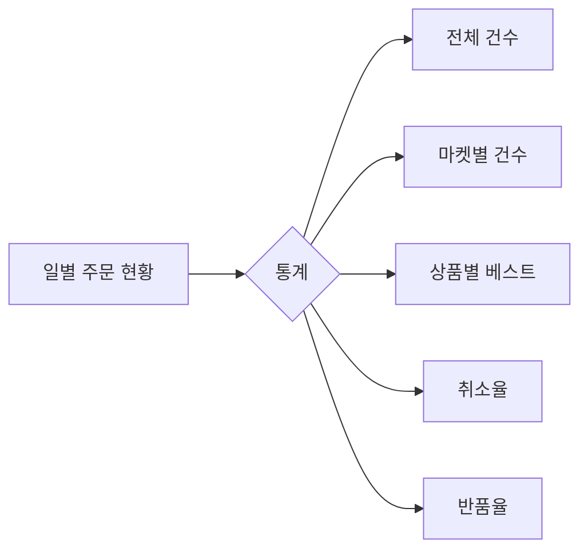
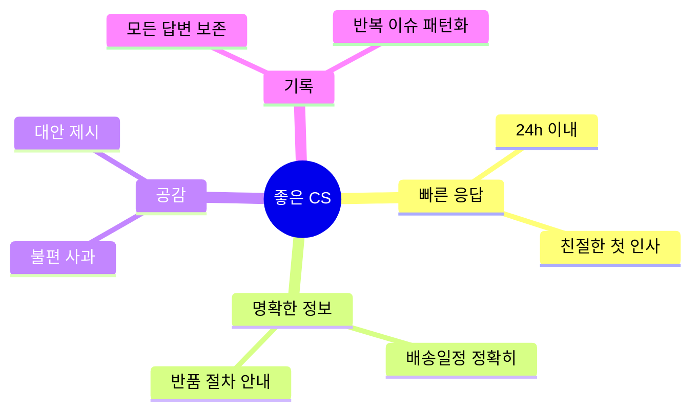

# 주문 + CS 통합 관리

> 4개 마켓 주문을 **한 화면에서**. 송장도 한 번 등록하면 4마켓에 자동 분배.

!!! tip "🎯 이 챕터에서 배우는 것"
    - 4마켓 주문이 Lonit 한 화면에 모이는 흐름
    - 송장 1번 입력 → 4마켓 자동 전송
    - 클레임 (취소·반품·교환) 통합 처리
    - 마켓별 SLA (응답 시한) + 셀러 점수 영향

---

## 1. 주문 통합 — 셀러 시간을 가장 많이 줄이는 기능



**T사 시절**: 4마켓 셀러센터를 각각 들어가 주문 확인.
**Lonit**: 1개 화면에서 모든 마켓 주문.

### 1-1. 주문 동기화 주기

| 마켓 | 동기화 방식 |
|------|----------|
| 스마트스토어 | 정기 동기화 (셀러 설정 가능) |
| 쿠팡 | 정기 동기화 (셀러 설정 가능) |
| 롯데온 | 정기 동기화 (셀러 설정 가능) |
| 11번가 | 정기 동기화 (셀러 설정 가능) |

!!! info "주기는 셀러가 조절할 수 있어요"
    Lonit은 정기 스케줄러로 마켓 주문을 가져옵니다. **자동화 설정**에서 동기화 간격(시간 단위)을 직접 설정할 수 있습니다. 즉시 받기를 원하면 화면 새로고침으로 수동 갱신도 가능합니다.

---

## 2. 주문 화면 — 정보 한눈에



각 마켓마다 다른 형식의 주문 정보를 **Lonit이 표준화**해서 보여줍니다.

### 2-1. 마켓별 표시 색상



화면에서 마켓을 색상으로 빠르게 구분.

---

## 3. 송장 등록 — 한 번으로 4마켓

가장 강력한 기능. 



### 3-1. 일괄 송장 등록

여러 주문을 한 번에:

1. **주문 목록 → 다중 선택**
2. **일괄 송장 입력 → 엑셀 붙여넣기**
3. 자동 분배

엑셀 형식:
```
주문번호 | 택배사 | 운송장번호
2026-001 | CJ대한통운 | 1234567890
2026-002 | 한진택배 | 9876543210
```

### 3-2. 다중 택배사 지원

| 택배사 | 코드 |
|------|------|
| CJ대한통운 | CJGLS |
| 한진택배 | HANJIN |
| 롯데택배 | LOTTE |
| 우체국 | EPOST |
| 로젠택배 | LOGEN |
| 딜리박스 | DELIBOX |

설정에서 자주 쓰는 택배사를 기본값으로 지정 가능.

---

## 4. 클레임 처리 — 취소·반품·교환



### 4-1. 클레임 액션 자동화

각 마켓의 클레임 처리 API를 Lonit이 자동으로 호출합니다.

| 마켓 | 지원 액션 |
|------|--------|
| **스마트스토어** | 승인 / 거부 / 회수 보류 / 재배송 |
| **쿠팡** | 승인 / 거부 |
| **롯데온** | 승인 / 거부 / 보류 |
| **11번가** | 승인 / 거부 / 회수 보류 |

### 4-2. CS 답변

각 마켓의 고객 문의도 Lonit 한 화면에서.



답변 템플릿을 미리 만들어두면 빠르게 응대 가능.

---

## 5. 주문 처리 SLA

각 마켓이 **셀러에게 요구하는 처리 시간**:

| 항목 | 스마트스토어 | 쿠팡 | 롯데온 | 11번가 |
|------|------------|------|------|------|
| 주문 확인 | 24h 이내 | 24h | 24h | 24h |
| 발송 | 결제 후 2영업일 | 2일 | 2일 | 2일 |
| CS 답변 | 24h | 24h | 24h | 24h |
| 클레임 응답 | 48h | 48h | 48h | 48h |

SLA를 어기면 **셀러 점수 감점** → 노출 가중치 손실.

Lonit의 알림 기능으로 SLA 임박 주문을 미리 알 수 있습니다.

---

## 6. 일별 주문 현황



**대시보드 → 매출 → 일별 현황** 에서 확인.

---

## 7. 자주 발생하는 함정

### 7-1. "송장 입력했는데 마켓에 안 나타남"

대부분 **택배사 코드 mismatch**. Lonit의 매핑 테이블을 확인하거나 [트러블슈팅](08-troubleshooting.md) 참고.

### 7-2. "주문이 Lonit에 안 들어옴"

마켓 API 키 만료 또는 IP 등록 문제. **설정 → 마켓 계정 → 연결 테스트**.

### 7-3. "클레임 답변이 마켓에 안 보임"

답변 후 마켓 동기화까지 1분 정도 걸림. 대기.

---

## 8. CS 운영 베스트프랙티스



Lonit의 CS 화면은 **답변 이력 자동 보존** + **반복 이슈 자동 패턴화**를 지원합니다.

---

!!! success "📌 한 줄 요약"
    4마켓 주문은 한 화면에 통합. **송장 1번 입력 → 4마켓 자동 분배**. 클레임도 한 곳에서 처리. SLA(24h 응답) 지키면 셀러 점수 ↑.

---

## 다음 단계

<div class="lonit-cards">

<a class="lonit-card" href="../07-pricing/">
<span class="lonit-card-icon">💰</span>
<h3>7. 가격 정책</h3>
<p>마진 공식·정책 우선순위·자동 조정</p>
</a>

<a class="lonit-card" href="../08-troubleshooting/">
<span class="lonit-card-icon">🔍</span>
<h3>8. 트러블슈팅</h3>
<p>자주 발생하는 에러 해결법</p>
</a>

</div>
