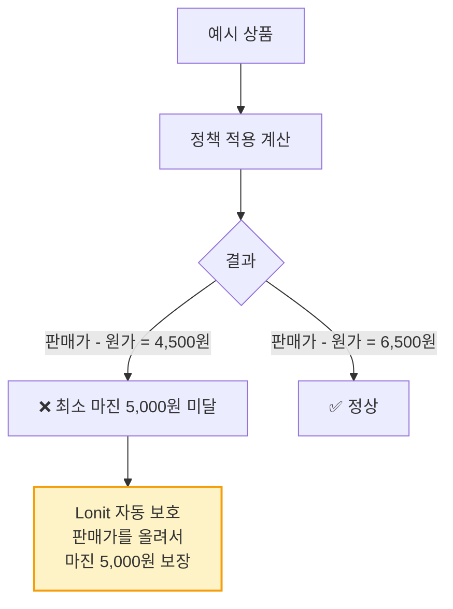
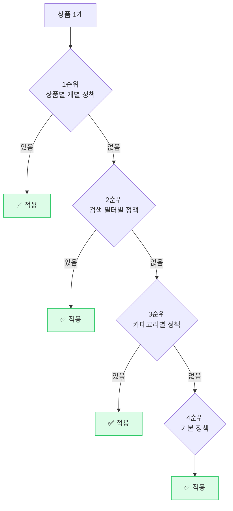
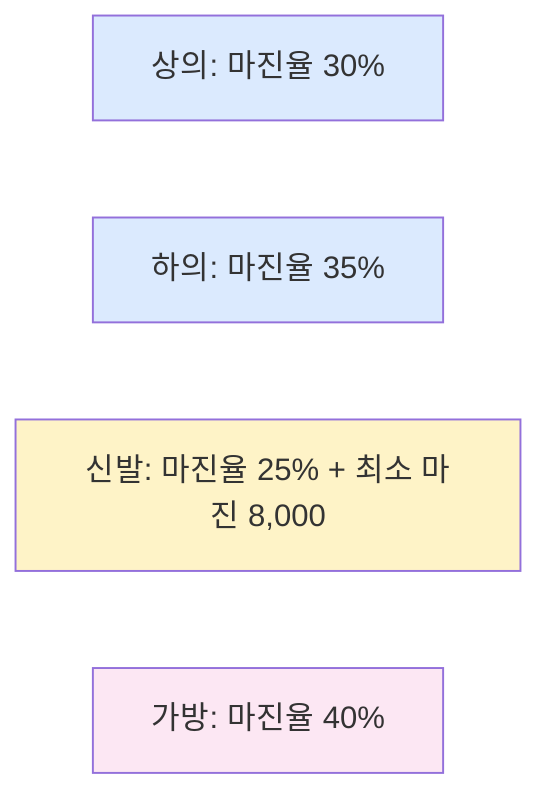
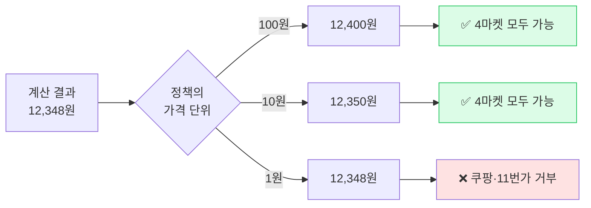
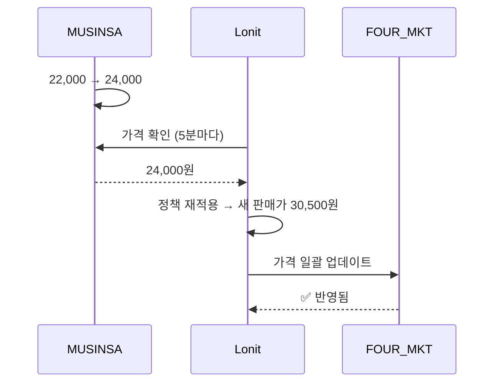
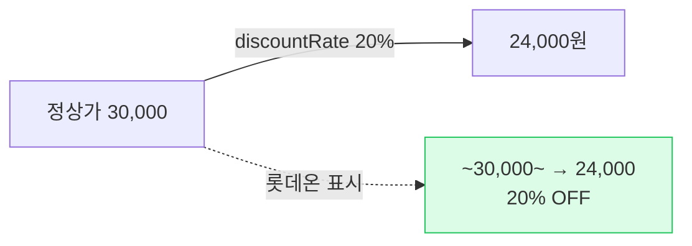
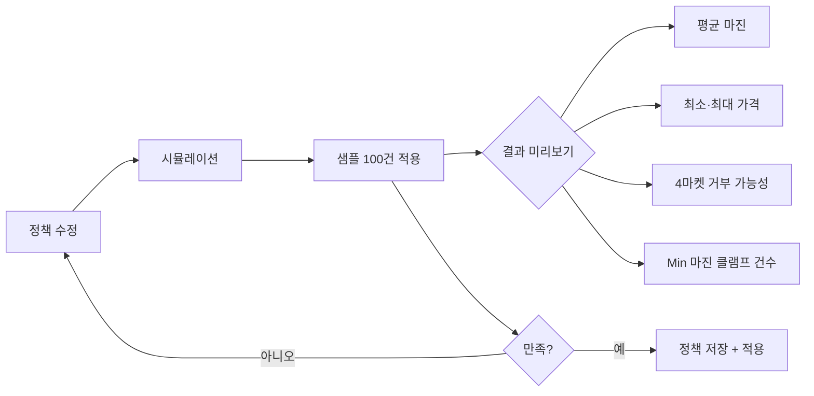
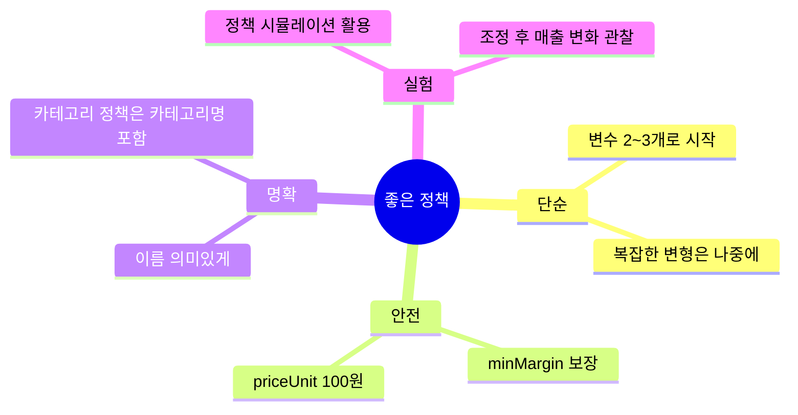

# 가격 정책 — 셀러의 가장 중요한 설정

> 정책 1번 잘 만들면 모든 상품이 자동으로 정확한 가격에 등록되고 동기화됩니다.

---

## 1. 가격 공식 — 한눈에

<div class="price-formula">
<b>판매가 = (원가 + 베이스 마진) × (1 + 마진율) ÷ (1 - 수수료율)</b><br><br>
<small>최소 마진 미달 시 → 최소 마진 금액으로 클램프 (보호)</small>
</div>

```mermaid
flowchart TB
    매입[매입가<br>예: 18,000] --> Base[+ 베이스 마진<br>예: 1,000]
    Base --> Calc1[원가: 19,000]
    
    Calc1 --> Margin{× 1 + 마진율}
    Margin -->|30%| Calc2[19,000 × 1.30<br>= 24,700]
    
    Calc2 --> Fee{÷ 1 - 수수료}
    Fee -->|12% 수수료| Calc3[24,700 ÷ 0.88<br>= 28,068]
    
    Calc3 --> Min{최소 마진 검증}
    Min -->|마진이 5,000 이상| Pass[✅ 28,070원<br>(100원 단위 정렬)]
    Min -->|미달| Clamp[최소 마진<br>보장가로 변경]
    
    style Pass fill:#dcfce7,stroke:#22c55e,stroke-width:2px
```

### 1-1. 8가지 정책 변수

```
판매가 = (원가 + baseMargin + extraFee) × (1 + marginRate) ÷ (1 - feeRate)
                                                         × (1 - discountRate)
                                                         - discountAmount
                                                         - marginAmount (있으면 마진 고정)
```

| 변수 | 의미 | 일반 셀러 추천 값 |
|------|------|--------------|
| `baseMargin` | 고정 마진 (원당) | 1,000원 |
| `extraFee` | 추가 비용 (포장·배송 등) | 0원 |
| `marginRate` | 마진율 (%) | 30% |
| `feeRate` | 마켓 수수료 (%) | 12% (평균) |
| `discountRate` | 추가 할인율 (%) | 0% |
| `discountAmount` | 추가 할인 금액 | 0원 |
| `marginAmount` | 마진 고정 (마진율 무시) | 0 (사용 X) |
| `minMargin` | 최소 마진 보장 | 5,000원 |

이게 다 어렵게 느껴진다면 **`marginRate`(마진율) + `minMargin`(최소 마진)** 두 개만 신경 쓰면 됩니다. 나머지는 기본값.

---

## 2. 첫 정책 만들기 — 셀러 추천


| 항목 | 값 | 의미 |
|------|----|----|
| 정책 이름 | `기본 정책` | 식별용 |
| 마진율 | `30%` | 원가의 30% |
| 최소 마진 | `5,000원` | 마진율 적용해도 최소 5천원 보장 |
| 수수료 | `12%` | 마켓 평균 |
| 가격 단위 | `100원` | 마지막 자리 100원 단위 정렬 |
| 활성 마켓 | 4마켓 모두 | 전체 적용 |

저장하면 끝. 모든 신규 등록 상품에 자동 적용됩니다.

---

## 3. 최소 마진 보장 — 가장 헷갈리는 개념



### 3-1. 왜 필요한가?

원가가 매우 낮은 상품(예: 1,000원)에 마진율 30%만 적용하면 마진 300원밖에 안 됨. 손실 위험.

`minMargin: 5000` 설정하면 → **항상 5,000원 마진 보장**.

### 3-2. 화면 가격과 실제 등록 가격 일치

상품 목록 화면의 가격 패널에서도 동일한 최소 마진 보장이 적용됩니다. 셀러가 보는 가격과 마켓에 실제로 등록되는 가격이 항상 일치합니다.

---

## 4. 정책 우선순위

상품에 어떤 정책이 적용되는지의 우선순위:



대부분 셀러는 **기본 정책 1개만** 쓰면 충분.

### 4-1. 카테고리별 다른 정책 — 언제 쓰나?



카테고리마다 평균 마진이 달라서, 신발은 마진율 낮게 + 최소 마진 높게, 가방은 마진율 높게 등.

---

## 5. 가격 단위 — 마켓별 거부 방지

마켓마다 받는 가격 단위가 다릅니다.

| 마켓 | 최소 가격 단위 |
|------|------------|
| 스마트스토어 | 1원 (관계 없음) |
| 쿠팡 | **10원** (1원 단위 거부) |
| 롯데온 | 1원 |
| 11번가 | 10원 |



**100원 단위**가 가장 안전. 1원 단위로 정밀하게 가격을 맞추는 건 셀러에게 의미 없고, 4마켓 거부 위험만 큽니다.

### 5-1. 방향 안전 정렬

`/100` 정렬 시 항상 **올림**(`ceil`) 또는 **내림**(`floor`) 중 정책에 맞는 방향으로:

| 방향 | 결과 |
|------|------|
| `priceUnit: 100, ceil` (올림) | 12,348 → 12,400 (마진 ↑) |
| `priceUnit: 100, floor` (내림) | 12,348 → 12,300 (가격 경쟁력 ↑) |
| `priceUnit: 100, round` (반올림) | 12,348 → 12,300 (반올림) |

기본은 **olil(올림)** — 마진 보호.

---

## 6. 자동 가격 조정

### 6-1. 무신사 가격 변경 시 자동 반영



### 6-2. 정책 변경 시 자동 반영

정책 마진을 30→35로 바꾸면:

- 즉시 모든 적용 상품의 변경 표시 갱신
- Lonit 동기화 엔진이 변경 감지
- 4마켓에 새 가격 업데이트

수천 건 상품도 **수 분 안**에 모두 반영됩니다.

### 6-3. 가격이 0인 예외 상황 자동 보호

매우 드물게 가격이 0으로 잘못 계산되는 경우가 생기면 Lonit이 자동으로 보호 로직을 적용해 마켓에 등록되지 않게 막습니다. 셀러는 별도로 신경 쓸 필요 없습니다.

---

## 7. 정책 변수 — 고급

### 7-1. extraFee — 추가 비용

포장비·배송비 같은 고정 비용. 

```
판매가 = (원가 + baseMargin + extraFee) × ...
```

기본은 0. 포장이 까다로운 상품(향수·도자기 등)에 1,000~3,000원 추가.

### 7-2. discountRate / discountAmount — 추가 할인

마진을 그대로 두고 **사용자에게 할인 표시**할 때.



롯데온의 정가/할인가 분리 등록과 결합되어 노출 효과 ↑.

### 7-3. marginAmount — 고정 마진

마진율 대신 고정 금액 마진을 원할 때:

```
판매가 = 원가 + marginAmount + 수수료
```

특수 상품(중저가 가방 등)에 가끔 사용. 일반 셀러는 안 씀.

---

## 8. 정책 시뮬레이션

정책을 만든 뒤 **저장하기 전**에:

**정책 → 시뮬레이션** 버튼.



**저장 전 시뮬레이션**으로 가격이 너무 높거나 낮은 건 없는지 확인하는 게 안전.

---

## 9. 자주 발생하는 문제

### 9-1. "정책 바꿨는데 가격 반영 안 됨"

동기화 엔진이 5분 주기로 동작합니다. 5분 안에 자동 반영. 그래도 안 되면:

**상품 → 가격 강제 동기화** 클릭.

### 9-2. "최소 마진 5,000인데 판매가 4,000?"

화면 표시와 실제 등록가가 다르게 보이는 경우 — 새로고침 후 재확인. 그래도 동일하면 [트러블슈팅](08-troubleshooting.md)에서 문의.

### 9-3. "쿠팡만 가격이 다름"

쿠팡 1원 단위 거부 → Lonit이 10원으로 정렬. `priceUnit: 100`으로 맞추면 4마켓 일치.

---

## 10. 정책 베스트프랙티스



---

## 다음 단계

<div class="lonit-cards">

<a class="lonit-card" href="../08-troubleshooting/">
<span class="lonit-card-icon">🔍</span>
<h3>8. 트러블슈팅</h3>
<p>자주 발생하는 에러 해결법</p>
</a>

<a class="lonit-card" href="../05-workflow/">
<span class="lonit-card-icon">🔄</span>
<h3>5. 일상 워크플로우</h3>
<p>운영 흐름 다시 보기</p>
</a>

</div>
