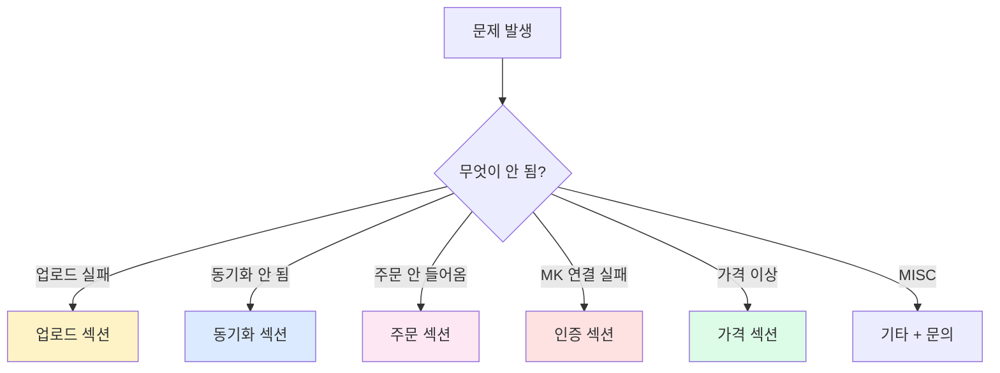
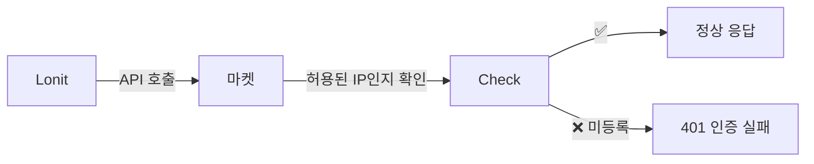
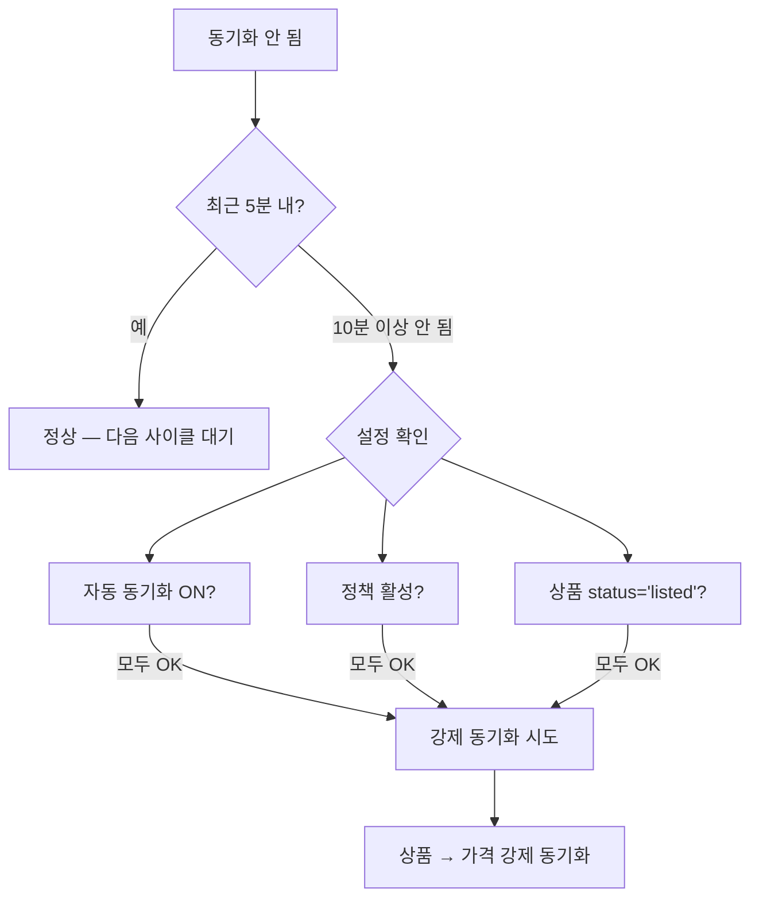
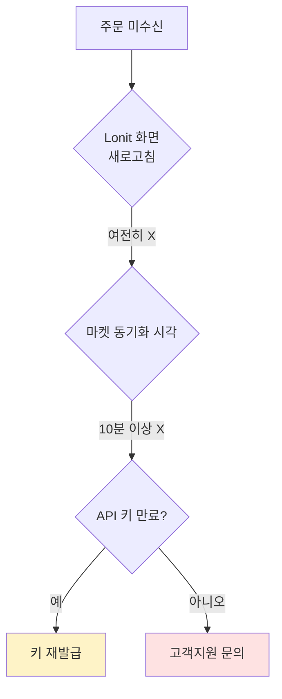
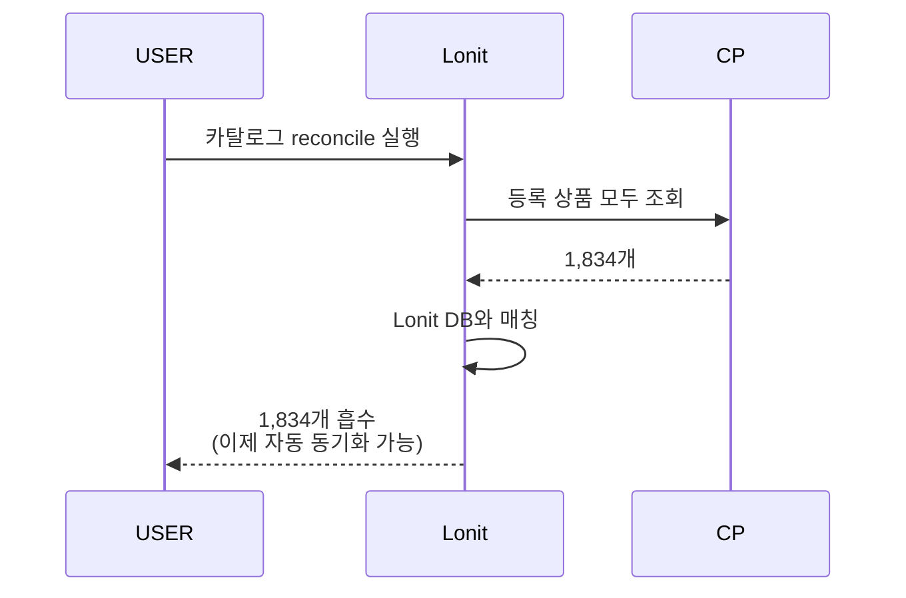
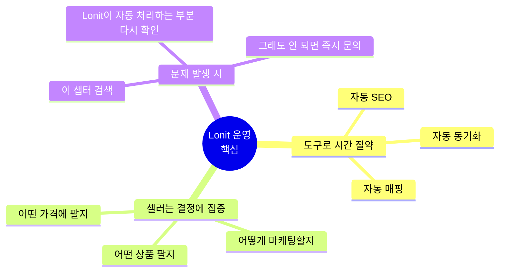

# 트러블슈팅

> 자주 발생하는 문제와 해결법. **검색을 활용하세요** — 우측 상단 🔍 클릭 또는 `/` 키.

---

## 1. 일반적인 첫 진단 흐름

---

## 2. 마켓 연결 / 인증 문제

### 2-1. "API 인증 실패"

**대부분 IP 등록 누락**.

해결:
1. 마켓 셀러센터 → API 관리 → IP 화이트리스트
2. **`158.247.214.201`** 추가
3. 1~24시간 적용 대기
4. Lonit → 설정 → 마켓 계정 → 연결 테스트

### 2-2. "쿠팡 인증 실패" 오류

쿠팡 API 키 만료가 가장 흔한 원인. Lonit이 인증 형식 자체는 자동으로 맞춥니다.

해결: **API 키 재발급** 후 Lonit → 설정 → 마켓 계정 → 쿠팡에서 키 업데이트.

### 2-3. "11번가 IP not allowed"

11번가는 IP 제한이 까다롭습니다. 등록 후 **반드시 1시간 이상** 대기 후 테스트.

---

## 3. 업로드 문제

### 3-1. "스마트스토어 카테고리 매핑 실패"

**증상**: 업로드 시 "카테고리 매핑되지 않음" 에러

원인:
- 카테고리 매핑 캐시 미생성
- 키워드 매칭 실패

해결:
1. 상품 → 상세 → **카테고리 수동 변경**
2. 비슷한 상품에는 자동으로 같은 카테고리 학습됨
3. **다중 매핑 도구**: 상품 목록 → 다중 선택 → "카테고리 자동 재매핑"

### 3-2. "쿠팡 옵션값 30자 초과"

해결: Lonit이 자동 줄임. 만약 의미가 너무 손상되면 상품 → 옵션 → 수동 편집으로 짧게.

### 3-3. "977건 suspended"

스마트스토어에서 일부 상품이 **suspended** (검수 중지).

원인: 카테고리 또는 속성 매핑 오류 (주로 SSG 상품).

해결:
1. 상품 → 필터 → 상태 = `suspended`
2. 다중 선택 → 카테고리 재매핑
3. 재업로드

### 3-4. "롯데온 매장 ID 누락"

해결: 설정 → 마켓 계정 → 롯데온 → 매장 ID 입력.

### 3-5. "11번가 KC 인증 필요"

해결: 정책 → 11번가 인증 정보 → KC 인증번호 입력.

---

## 4. 동기화 문제

### 4-1. "가격 동기화 안 됨"

### 4-2. "재고가 마켓에는 100인데 Lonit에는 50"

Lonit이 정확. **마켓은 1분 동기화 지연**. 1~5분 후 재확인.

### 4-3. "Continuous-updater 자동 중지"

증상: 동기화가 갑자기 멈춤

원인: 무신사 등 소싱처에서 에러율 30% 이상 발생 시 자동 일시 중지.

해결:
- 자동 복구 (5~30분)
- 수동 재개: 설정 → 동기화 → "강제 재개"

---

## 5. 가격 문제

### 5-1. "마진 5,000인데 판매가 너무 낮음"

원인: 정책의 최소 마진 보장이 일시적으로 적용 안 됨.

해결:
1. 새로고침
2. 정책 시뮬레이션으로 검증
3. 그래도 발생 시 `support@lonit.kr` 문의

### 5-2. "쿠팡 가격만 다름"

원인: 쿠팡 1원 단위 거부 → 자동 10원 정렬 → Lonit 표시 가격과 차이.

해결: 정책 → priceUnit `100`으로 변경. 4마켓 가격이 일치.

### 5-3. "롯데온에 할인이 안 보임"

원인: 과거 정가/할인가 분리 처리에 일시적 이슈가 있었으나 현재는 해결되었습니다.

해결:
- 자동 (재업로드 시 정상 적용)
- 강제 재업로드: 상품 → 다중 선택 → "가격 강제 푸시"

---

## 6. 주문 문제

### 6-1. "주문이 Lonit에 안 들어옴"

### 6-2. "송장 입력했는데 마켓에 안 보임"

대부분 **택배사 코드 mismatch**.

해결:
1. 주문 → 해당 주문 → 송장 정보 확인
2. 택배사가 마켓 셀러센터의 코드와 일치하는지
3. 다시 송장 등록 (정확한 코드로)

### 6-3. "발송 처리 안 됨"

Lonit의 송장 등록은 마켓 API 호출 → 1분 안에 반영. 5분 이상 안 되면 마켓 셀러센터 직접 확인.

---

## 7. 쿠팡 orphan 문제 { #쿠팡-orphan }

쿠팡 셀러센터에 등록된 상품이 Lonit에는 없는 경우.

**대시보드 → 쿠팡 → 카탈로그 동기화** 클릭. 자세한 단계는 [4-2. 쿠팡](04-market-strategy/coupang.md) 참고.

---

## 8. 기존 마켓 상품 가져오기 { #기존-마켓-상품-가져오기 }

이미 마켓에 등록된 상품을 Lonit으로 흡수.

| 마켓 | 지원? |
|------|-----|
| **스마트스토어** | ✅ 부분 (catalog reconcile) |
| **쿠팡** | ✅ |
| **롯데온** | 🚧 진행 중 |
| **11번가** | 🚧 진행 중 |

---

## 9. Smartstore Suspended { #smartstore-suspended }

977건 suspended 발생 시 (가장 흔한 SSG 상품 카테고리 오류):

1. 상품 목록 → 필터 → `상태 = suspended`
2. 다중 선택 → "카테고리 자동 재매핑"
3. 재업로드

자세히는 [4-1. 스마트스토어](04-market-strategy/smartstore.md#smartstore-suspended) 참고.

---

## 10. 익스텐션 문제

### 10-1. "수집 버튼 눌러도 반응 없음"

해결:
1. Chrome → `chrome://extensions/` → Lonit 익스텐션 → "다시 로드"
2. 페이지 새로고침
3. 그래도 안 되면 익스텐션 재설치

### 10-2. "데이터가 잘못 들어옴"

소싱처 페이지 구조 변경 가능성. 일주일 안에 패치.

해결: 그동안 수동 편집 또는 다른 페이지에서 수집.

---

## 11. 자주 묻는 질문

### Q1. 무료 체험 기간이 있나요?

네, 가입 후 첫 7일은 모든 기능 무제한.

### Q2. 데이터 백업은?

Lonit은 자동으로 매일 백업. 셀러가 별도 작업할 필요 없음.

### Q3. 다른 셀러가 내 데이터 볼 수 있나요?

❌ 절대 불가. **멀티테넌트 격리**로 모든 데이터는 셀러별로 완전 분리.

### Q4. 한국 외 마켓도 지원?

현재 한국 4마켓만. 추후 글로벌 확장 검토 중.

### Q5. 무신사 외 다른 소싱처?

현재 12개 사이트:
- 무신사, 29CM, W컨셉, 패션플러스 (패션)
- SSG, 롯데아이몰, GS샵, 현대H몰, G마켓 (종합)
- ABC마트, 올리브영 (기타)

---

## 12. 더 빠른 도움 받기

### 12-1. 검색

우측 상단 🔍 또는 `/` 키 → 키워드 검색.

### 12-2. 챕터별 함정 모음

- [스마트스토어 함정](04-market-strategy/smartstore.md#troubleshooting)
- [쿠팡 함정](04-market-strategy/coupang.md#troubleshooting)
- [롯데온 함정](04-market-strategy/lotteon.md#troubleshooting)
- [11번가 함정](04-market-strategy/11st.md#troubleshooting)

### 12-3. 직접 문의

- **이메일**: `support@lonit.kr`
- **응답 시간**: 영업시간 기준 24시간 안

문의 시 다음 정보를 함께 보내주시면 빠릅니다:

- 사용자 이메일
- 문제 발생 시각
- 영향받은 상품 ID 또는 주문 번호
- 캡처 스크린샷 (있으면)

---

## 13. 시스템 점검 일정

매월 **첫째 일요일 새벽 3시 ~ 4시** 정기 점검.

긴급 점검은 **대시보드 상단 배너**로 사전 공지.

---

## 14. 마지막으로

---

<a class="lonit-card" href="../">
🏠
<h3>홈으로</h3>

매뉴얼 메인 페이지

</a>

<a class="lonit-card" href="../01-getting-started/">
🚀
<h3>처음부터 다시</h3>

5분 빠른 시작

</a>

