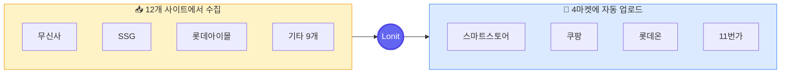

---
hide:
  - navigation
  - toc
---

# Lonit 매뉴얼 { .center }

셀러를 위한 4마켓 자동화 가이드

스마트스토어
쿠팡
롯데온
11번가

---

!!! abstract "📸 스크린샷 추가 위치 (편집자 메모)"
    여기에 대시보드 메인 화면 스크린샷을 추가하면 임팩트가 가장 큽니다.
    캡처 후 `docs/assets/screenshots/dashboard-main.png` 으로 저장하고 이 admonition 을 `` 로 바꿔주세요.
    전체 가이드는 `manual/SCREENSHOTS.md` 참고.

## 어떤 분이세요? { .center }

<a class="lonit-card" href="01-getting-started/">
🚀
<h3>처음 쓰는 분</h3>

5분 만에 첫 상품 등록까지. 가입부터 동기화까지 한 번에.

</a>

<a class="lonit-card" href="02-architecture/">
📚
<h3>강의를 듣는 분</h3>

챕터 순서대로 차근차근. 시스템부터 마켓 전략까지.

</a>

<a class="lonit-card" href="08-troubleshooting/">
🔍
<h3>이미 쓰고 있는 분</h3>

특정 기능만 빠르게 찾기. 검색 + 트러블슈팅 + 마켓별 가이드.

</a>

---

## Lonit이 하는 일 한 줄 { .center }

<b>무신사·SSG·롯데아이몰</b>처럼 12개 사이트에서 상품을 모아 
<b>스마트스토어·쿠팡·롯데온·11번가</b>에 한 번에 올리고 자동으로 가격·재고를 맞춥니다.

---

## 핵심 가치 4가지 { .center }

⚡
<h3>한 번 등록 → 4마켓 동시</h3>

한 상품을 한 번 만들면 4개 마켓에 동시 업로드. 마켓별 폼 작성 안 해도 됨.

🔄
<h3>가격·재고 자동 동기화</h3>

소싱처 가격이 바뀌면 4개 마켓 가격도 자동으로. 재고도 똑같이.

🎯
<h3>마켓별 노출 최적화</h3>

스마트스토어 SEO, 쿠팡 옵션 매칭, 롯데온 정책 — 마켓별 알고리즘 맞춤.

📦
<h3>주문·CS 한 곳에서</h3>

4개 마켓의 주문·문의·반품을 하나의 대시보드에서. 송장도 한 번에 등록.

---

## 빠른 시작 4단계 { .center }

1

<h4>회원가입 + 마켓 계정 등록</h4>

Lonit에 가입한 뒤 운영하는 4마켓 계정의 API 키를 등록합니다. <a href="01-getting-started/#1-회원가입">자세히 보기</a>

2

<h4>크롬 익스텐션 설치</h4>

무신사·SSG 등에서 상품을 수집하는 도구. Chrome에 설치만 하면 끝. <a href="01-getting-started/#2-크롬-익스텐션-설치">자세히 보기</a>

3

<h4>가격 정책 1개 만들기</h4>

마진과 할인 규칙을 한 번 정해두면 모든 상품에 자동 적용. <a href="07-pricing/">정책 자세히</a>

4

<h4>첫 상품 등록 + 4마켓 업로드</h4>

익스텐션으로 무신사 상품 1개 수집 → "4마켓 업로드" 클릭. 끝. <a href="05-workflow/">전체 워크플로우</a>

---

## 챕터별 길잡이

| 챕터 | 누구에게? | 무엇을 배우는가? |
|------|-----------|----------------|
| [1. 시작하기](01-getting-started.md) | 신규 가입자 | 가입 → 첫 상품 등록까지 5분 |
| [2. 시스템 구조](02-architecture.md) | 강의 수강생 | Lonit이 어떻게 동작하는지 한눈에 |
| [3. 더망고와 비교](03-vs-themango.md) | 더망고 사용자 | 차이점 + Lonit으로 갈아타는 방법 |
| [4. 4마켓 노출 전략](04-market-strategy/index.md) | **모두 ⭐** | 마켓별 알고리즘 + 노출 잘 되는 법 |
| [5. 일상 워크플로우](05-workflow.md) | 운영 중 | 수집 → 등록 → 동기화 매일 흐름 |
| [6. 주문 + CS](06-orders-cs.md) | 주문 받기 시작 | 4마켓 주문 통합 + 송장 + 클레임 |
| [7. 가격 정책](07-pricing.md) | 셀러 전체 | 마진 공식 + 자동 가격 조정 |
| [8. 트러블슈팅](08-troubleshooting.md) | 문제 발생 시 | 자주 발생하는 에러 해결법 |

!!! tip "🎯 가장 먼저 읽어야 할 챕터"
    **신규 가입자**: [1. 시작하기](01-getting-started.md) → [4. 마켓 노출](04-market-strategy/index.md)
    **강의 수강생**: 1 → 2 → 3 → 4 순서대로
    **더망고 출신**: [3. 더망고와 비교](03-vs-themango.md) 부터

---

✨ Lonit은 1인 셀러도 4마켓을 동시에 운영할 수 있게 만드는 자동화 도구입니다. 
질문이나 제안은 <code>support@lonit.kr</code> 로 보내주세요.

